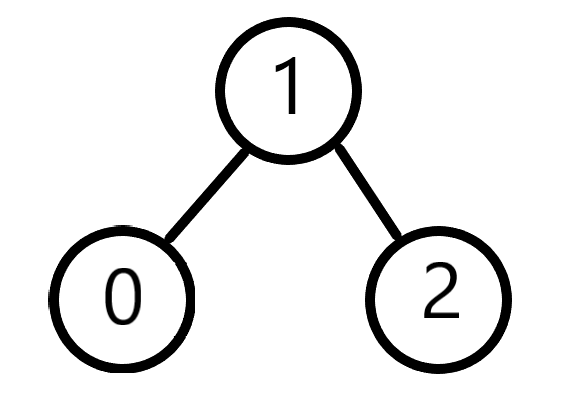

# 그래프 유형

> 정점(Node)과 간선(Edge)으로 이어진 자료구조

**"점과 선으로 이어진 데이터"**

그래프 문제는 "`공식`"이 중요하다.

각 유형마다 사용하는 특유의 방법이 있고 이를 바로바로 활용할 수 있는 능력이 문제를 풀 때 요구된다. (시간이 충분하다면 고민하면서 찾아볼 수 있겠지만 실제 시험에선 그렇게 오래 즐길 시간이 주어지지 않는다)


방향 유무, 사이클 유무, 가중치 유무 등에 따라 구분될 수 있지만 지금은 문제 유형에 집중

(그래프의 일종인 트리는 따로 다룰 계획)


## 그래프 표현법



(예시 그래프)


1. 인접 행렬

```
[
    [0,1,0],
    [1,0,1],
    [0,1,0]
]
```

각 노드마다 대응되는 배열이 있으며 **모든 노드에 대한 연결 상태**를 표현

- 두 노드가 연결되어 있는지 확인하는 것이 빠름

- 특정 노드와 연결된 모든 노드를 찾는 건 느림 (간선이 많을수록 유리)

- 많은 메모리 사용 (고정된 n^2 만큼의 메모리 필요)


2. 인접 리스트

```
[
    [1],
    [0,2],
    [1]
]
```

각 노드마다 대응되는 리스트가 있으며 **연결된 노드만** 표현

- 두 노드가 연결되어 있는지 확인하는 것이 느림

- 특정 노드와 연결된 모든 노드를 찾는 건 빠름 (간선이 적을수록 유리)

- 필요한 메모리 사용


3. 간선 리스트

```
[
    [0,1],
    [1,2]
]
```

**엣지**만 표현

간선 위주로 문제를 풀어가는 크루스칼 알고리즘에서 사용


## 문제 유형

### DFS, BFS

- DFS : 연결 노드를 `Stack`에 담음
  - 모든 노드를 방문할 때 좋음
  - 일단 멀리까지 가야하는 경우 조기 탐색 가능성이 있음 (깊이 찌르면서 가기 때문)
    - 대신 얻은 해가 <u>최단 경로라는 보장이 없음</u>
  - 사이클 탐지 / 위상 정렬에 적합


- BFS : 연결 노드를 `Queue`에 담음 (`from collections import deque`)
  - **최단 경로 탐색** (가중치가 없는 경우)
  - 효율적으로 움직여야 하는 경우 좋음 (가까이 있는 노드부터 탐색하며 이동하기 때문)
  - **가중치가 없는 그래프의 최단 경로는 BFS로 접근**


#### 백트래킹

`유망성 검사`를 통해 **가지치기**를 하는 것
(일반적으로 DFS에서 많이 사용하지만 BFS에서도 사용 가능)

즉 더이상 진행해봤자 무의미한 루트는 Stack이나 Queue에 담지 않고 버리는 것

```python
# N-Queen 문제
# https://www.acmicpc.net/problem/9663

import sys
input = sys.stdin.readline

N = int(input())

count = 0
queens = [[0,{i},{i},{i}] for i in range(N)] # row, column, 우하, 우상

while queens:
    queen = queens.pop()
    
    # 가지치기 단계
    if queen[0]+1 == N:
        count += 1
        continue

    for next in range(N):
        if next not in queen[1] and next-(queen[0]+1) not in queen[2] and next+(queen[0]+1) not in queen[3]:
            queens.append([queen[0]+1, queen[1] | {next}, queen[2] | {next-queen[0]-1}, queen[3] | {next+queen[0]+1}]) # 우하 대각선은 x-y, 우상 대각선은 x+y와 같다.

print(count)
```


### 최소 신장 트리 (Minimum Spanning Tree; MST)
```
신장 트리 : N개의 정점이 N-1개의 간선을 가지는 한 줄로 이어진 그래프 (최소 연결 그래프)

최소 신장 트리 : 가중치의 합이 최소가 되는 신장 트리
```

MST 문제는 **가중치가 있는 그래프**에서 가중치의 합이 최소가 되는 MST를 찾으라는 형식으로 나온다.

이전에 소개한 그리디를 사용하여 해결할 수 있는 유형이다.

#### 프림 알고리즘 (Prim)

`간선이 많을 때 사용` - **간만프**

**하나의 정점에서 연결된 간선 중 최소 비용 간선 선택** (정점 위주)

[활용]

```python
# 세팅
INF = 999999999
V, E = map(int,input().split())
adj = [[987654321] * (V+1) for _ in range(V+1)]
for i in range(E):
    start, end, weight = map(int, input().split())
    adj[start][end] = adj[end][start] = weight

# Prim 시작
distance = [INF] * (V+1) # Spanning Tree로부터 정점까지의 거리
visited = [False] * (V+1) # Spanning Tree에 추가 여부

distance[V] = 0

for _ in range(V): # 정점 V개를 돌면서 연결
    min_idx = -1
    min_value = INF

    # 최소 거리인 노드 선택
    for i in range(V+1):
        if not visited[i] and distance[i] < min_value:
            min_idx = i
            min_value = distance[i]
    visited[min_idx] = True
    # 새로 추가된 노드에 대해 거리 갱신
    for i in range(V+1):
        if not visited[i] and adj[min_idx][i] < distance[i]:
            distance[i] = adj[min_idx][i]

print(sum(dist)) # MST 가중치의 합
```

1. 임의의 정점 선택
2. 인접 정점 중 **최소 비용의 간선을 가지는 정점** 선택
   - 여기서 인접 정점은 신장 트리와 연결된 모든 정점이 대상
3. 2를 반복


#### 크루스칼 알고리즘 (Kruskal)

`간선이 적을 때 사용` - **간적프**

**트리의 모든 간선을 대상으로 최소 비용 간선을 하나씩 선택** (최소 비용 간선 위주)

크루스칼 알고리즘에서는 사이클 검증이 필요하기 때문에 "상호 배타 집합"을 활용한다

[활용]

```python
# 상호배타집합
def make_set(x):
    p[x] = x

def find_set(x):
    if p[x] != x:
        p[x] = find_set(p[x])
    return p[x]

def union(x, y):
    p[find_set(y)] = find_set(x)

# 세팅
INF = 999999999
V, E = map(int,input().split())
edges = [list(map(int, input().split())) for _ in range(E)] # 간선 리스트
edges.sort(key=lambda x: x[2]) # 간선을 가중치 순으로 오름차순 정렬

# 상호배타집합 p
p = [0]*(V + 1)
# 처음에는 각 노드가 독립적이기 때문에 각각 상호배타집합을 생성
for i in range(V + 1):
    make_set(i)

# Kruskal 시작
sum_mst = 0 # 가중치의 합
cnt = 0  # 간선 선택 횟수
idx = 0  # 간선의 인덱스 (가장 가중치가 낮은 0번부터 선택)

while cnt < V:
    x = edges[idx][0]
    y = edges[idx][1]

    if find_set(x) != find_set(y): # 사이클이 형성되는지 확인 (서로 상호 배타 집합인지)
        union(x, y)
        cnt += 1
        sum_mst += edges[idx][2]
    idx += 1

print(sum_mst) # MST 가중치의 합
```

1. 가중치에 따라 **간선을 오름차순 정렬**
2. 가중치가 낮은 간선부터 추가
   - 만약 사이클이 만들어지는 간선이면 Pass (상호 배타 집합 활용)
4. 2를 반복

#### + 상호 배타 집합 (Disjoint Set)

크루스칼 알고리즘에서 사이클이 형성되는지 확인해야 하는데, 이는 "두 집합이 **상호 배타 집합**인지 확인"하는 것으로 검증할 수 있다.

자세한 설명은 [이 글](https://parkjeongwoong.github.io/articles/Algorithm/0)을 참고하고 이 글에서는 사용 방법만 알아보자

[활용]

- **Make-Set(x)** : 유일한 멤버 x를 포함하는 새로운 집합 생성
- **Find-Set(x)** - x를 포함하는 집합 탐색, return representative
- **Union(x, y)** - x와 y를 포함하는 두 집합을 통합 / 집합 y의 대표를 집합 x의 대표로 바꾸는 것

```python
def make_set(x):
    p[x] = x

def find_set(x):
    if p[x] != x:
        p[x] = find_set(p[x])
    return p[x]

def union(x, y):
    p[find_set(y)] = find_set(x)

p = [0]*(3)
make_set(0)
make_set(1)
make_set(2)
# p = [0, 1, 2] ; p[i] = i로 각 원소들은 자기 자신 뿐인 집합을 가진다

union(0, 1)
# p = [0, 0, 2] ; 0과 1은 모두 대표값이 0인 동일한 집합에 속하게 되었다

union(1, 2)
# p = [0, 0, 1] ; 2의 대표값은 1이지만 1의 대표값이 0이므로 셋 다 모두 최종 대표값이 0인 동일한 집합이 되었다

find_set(0) # 0
find_set(1) # 0
find_set(2) # 0
# 0, 1, 2 모두 동일한 집합 0에 속하게 된다
```

상호 배타 집합의 깊이가 깊어질수록 연산 속도가 저하되는데 이에 대한 보다 자세한 내용은 [이 글](https://parkjeongwoong.github.io/articles/Algorithm/0)의 "상호배타 집합 자료구조 (Disjoint-sets)" 항목에 간단히 설명되어 있다


### 최단 경로 (가중치가 있는 경우)

가중치가 없는 그래프는 BFS로 찾을 수 있지만 가중치가 있는 그래프에선 다른 방법이 필요하다.

#### 다익스트라 알고리즘 (Dijkstra)

> 중점에서 다른 모든 점까지의 최단 경로

어떤 노드에서 다른 모든 노드까지의 최단 경로를 찾는 알고리즘

이 조건이 있는데, **음의 가중치가 허용되지 않는 것**이다.

[활용]

```python
def dijstra():
    # 세팅
    distance = [987654321]*(V+1)
    visited = [False] * (V+1)
    distance[0] = 0

    for _ in range(V):
        # 가장 가까운 노드를 찾는 과정
        min_idx = -1
        min_value = 987654321
        for i in  range(V+1):
            if not visited[i] and min_value > distance[i]:
                min_value = distance [i]
                min_idx = i
        visited[min_idx] = True # 찾음
        
        # 선택한 노드를 기준으로 최단 거리 갱신 (중점에서 선택한 노드로 이동했다고 가정)
        for i in range(V+1):
            if not visited[i] and adj[min_idx][i] + distance[min_idx] < distance[i]:
                distance[i] = adj[min_idx][i] + distance[min_idx]

    return distance[V]


for tc in range(1, int(input())+1):
    V, E = map(int , input().split())

   adj = [[987654321]*(V+1) for _ in range(V+1)] # 인접 행렬

   for i in range(E):
        start, end , weight = map(int , input().split())
        adj[start][end] = weight

   print("#{} {}".format(tc, dijstra()))
```

1. 중점으로 거리를 모두 최대값으로 초기화
2. (아직 선택되지 않은 정점 중) 중점으로부터 거리가 최소인 정점을 선택
3. 선택한 가장 가까운 정점을 방문해서 다른 정점으로 가는 경우의 수를 비교해서 최단 거리 갱신
4. 2, 3 반복

위의 소스코드가 헷갈릴 수 있는데 바깥 for문의 초회차 진행은 중점(0번)으로부터 다른 노드들 까지의 거리를 초기화 시켜주는 과정
2회차부터 위에서 말한 "중점으로부터 거리가 최소인 정점"을 탐색하고 갱신하는 과정이 진행됨

[heap을 사용한 방법]

```python
# 최단경로
# https://www.acmicpc.net/problem/1753

import heapq
import sys
input = sys.stdin.readline

V, E = map(int, input().split()) # 정점, 간선 개수
start_node = int(input()) # 시작 정점
nodes = [[] for _ in range(V+1)] # 인접 리스트
for i in range(E):
    from_node, to_node, cost = map(int,input().split())
    nodes[from_node].append((to_node, cost)) # 방향과 가중치 저장

visited = ['INF']*(V+1) # 여기에 최소 비용을 저장
visited[start_node] = 0

heap = []
heapq.heappush(heap, (0, start_node))

while heap:
    cost, node = heapq.heappop(heap)

    for next_node, next_cost in nodes[node]:
        new_cost = cost+next_cost
        if visited[next_node] == 'INF' or new_cost < visited[next_node]: # 최소 비용으로 갱신
            visited[next_node] = new_cost
            heapq.heappush(heap, (new_cost, next_node))
```

heap을 이용해서 최단거리 인접 정점을 찾고 거리를 갱신하는 방식


#### (추가)

이 알고리즘들은 추가적으로 알고 있으면 좋은 내용이다.

##### 벨만-포드 알고리즘

- 중점-다른 모든 점까지의 최단 경로
- 음의 가중치 허용


##### 플로이드-워샬 알고리즘

- 모든 정점에 대한 최단 경로
- 동적 계획 알고리즘 (DP)
- 모든 부분에 대하여 [`직선거리 vs 경유거리`] 중 짧은 경로 선택을 반복
- 이를 N*N 배열에서 계속 값을 갱신하면서 `O(N^3)` 시간만에 해답 도출
  - 경유, 시작, 끝, 이렇게 3개에 대해서 반복문 3번 돌림
  - 직선이 최단이면 직선 선택, **경유가 최단이면 경유에 대해서 다시 재귀 호출????**
  - DP적으로 풀면 재귀가 필요 없음

```python
import sys
input = sys.stdin.readline

N, M = map(int, input().split())

floyd_warshall = [[100]*N for _ in range(N)] # 최대 99

for i in range(N):
    floyd_warshall[i][i] = 0

for _ in range(M):
    a,b = map(int, input().split())
    floyd_warshall[a-1][b-1] = 1
    floyd_warshall[b-1][a-1] = 1

local_mins = 100
local_min_idx = -1

for m in range(N):
    for i in range(N):
        for j in range(N):
            floyd_warshall[i][j] = min(floyd_warshall[i][j], floyd_warshall[i][m]+floyd_warshall[m][j])
    
for i in range(N):
    kevin_bacon = sum(floyd_warshall[i])
    if local_mins > kevin_bacon:
        local_mins = kevin_bacon
        local_min_idx = i

print(local_min_idx+1)
```
