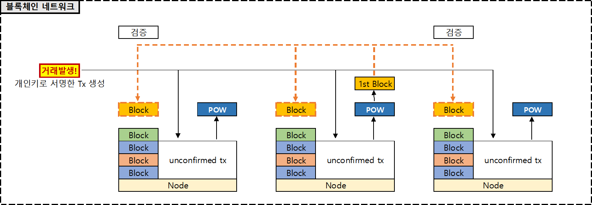

# [블록체인] 작업증명

블록체인은 "데이터 분산 처리 기술"이다. 즉 한 사람이 만들고 쓰는 것이 아니라 여러 사람이 네트워크를 형성하고 함께 데이터를 만들고 쓰며 운영된다.

이런 상황에서 결국 가장 중요한 문제는 "어떤 데이터를 저장할 것인가"이다.

블록체인 네트워크의 모든 참여자는 같은 블록체인을 가지고 있어야 하는데, 새로운 블록을 추가할 때 어떤 블록을 추가할지, 즉 어떤 데이터를 블록체인 네트워크에 저장할 지에 대한 합의가 필요하다.

이를 위한 알고리즘이 합의 알고리즘이고 대표적으로 **작업증명**(Proof of Work)과 **지분증명**(Proof of Stake)이 있다.

이번 글에선 가장 먼저 적용된 합의 알고리즘인 작업증명에 대해 이야기하고자 한다.


## 작업증명

가장 유명한 블록체인 네트워크인 비트코인 네트워크에서 사용하는 방식이다.

채굴이라고도 불리는 작업증명은 개인적으로는 이름만 봐서 그 의미가 와 닿지 않았다. (개인적으로는 채굴이라는 표현 때문에 더 헷갈린다고 생각한다.)

또 흔히들 문제를 풀면 코인을 준다는 식으로 표현되는데, 대체 작업증명에서는 **어떤 문제를, 왜 풀어야 할까?**


이전 글에서 블록체인의 데이터 블록은 [데이터 - 이전 해시값 - 해시값] 으로 이루어 진다고 했다.

블록체인의 데이터를 수정하면 다음과 같은 일이 일어난다.

```
(1) 블록1의 데이터를 바꾼다.

(2) 블록1의 데이터가 바뀌었기 때문에 데이터와 이전 해시값을 기반으로 만들어지는 블록1의 해시값이 변경된다.

(3) 블록1의 해시값이 바뀌었기 때문에 블록2의 이전 해시값이 바뀐다.

(4) 블록2의 이전 해시값이 바뀌었기 때문에 데이터와 이전 해시값을 기반으로 만들어지는 블록2의 해시값이 변경된다.

(5) 이후 반복
```

결국 모든 데이터 블록을 다 바꿔야 한다.

그런데 성능이 좋은 요즘 컴퓨터는 해시값을 구하는 게 일도 아니다. 따라서 이런 체이닝 구조만으로는 위변조를 막을 수 없다. 블록체인이 위변조가 어려운 이유는 "**동일한 블록체인을 동시에 여럿이서 소유**"하기 때문이다. 여러 노드가 같은 블록체인을 가지고 있기 때문에 위변조가 어려운 것이고 해시값은 위변조 여부를 검사하는 데 도움을 준다.

그런데 여기서 현대 컴퓨터의 놀라운 성능이 문제를 일으킨다. 뛰어난 성능의 노드 여러개가 블록체인 네트워크에 참여하게 되면 새로운 블록을 추가할 때(데이터를 저장할 때) 수많은 블록들이 동시에 생성되게 된다. 결국 모두가 각자 다른 블록체인을 가지게 되고 무결성이 깨지게 된다. (비슷한 시간에 체결된 미국에서 일어난 거래 A, 한국에서 일어난 거래 B, 유럽에서 일어난 거래 C를 미국에서 A-B-C로, 한국에서 B-A-C로, 유럽에서 C-A-B로 저장한 블록체인이 동시에 생성될 수 있다)

블록체인 네트워크에는 단 하나의 블록체인만 존재해야 하는데 이 경우 어떤 블록체인을 골라야 할 지 판단하기 어려워진다.

이런 문제를 해결하기 위해, 어떤 블록을 고를지 합의할 때 사용하는 것이 합의 알고리즘이다.

그리고 비트코인은 강제적인 비효율을 발생시켜 블록 생성 속도를 지연시키는 합의 알고리즘인 작업증명으로 이 문제를 해결했다.


작업증명 방식은 데이터 블록의 해시값이 특정한 규칙을 맞춰야만 검증된 데이터 블록으로 인정한다. (이 규칙의 목적은 오로지 블록 생성 속도 지연이다.)

데이터 블록의 해시값을 변경하기 위해 해시값을 만드는 input 값에 **nounce**라는 정수를 추가해 3개의 입력(데이터, 이전 해시값, nounce)으로 해시값을 구한다.

해시값은 예측이 되지 않기 때문에 이렇게 생성된 해시값이 규칙을 맞추지 못할 확률이 크고 이 규칙에 맞는 해시값이 나올 때 까지 계속 nounce 값을 바꾸면서 해시값을 계산하는 게 작업증명이고 적합한 해시값을 찾아 블록을 생성하면 보상으로 코인을 받는다.


> 한 마디로 요약하자면 이렇다.
>
> 상품을 한 명에게 수여해야 하는데 너무 많은 사람이 동시에 손을 들어 누구에게 줄 지 결정하기가 힘든 문제를 해결하기 위해
>
> 내가 마음 속에 생각하고 있는 1~1,000,000,000 사이의 숫자를 맞추는 사람에게 주겠다고 선언하는 게 작업증명이다.
>
> 상품 자체와는 연관 없는 행위이고 수 많은 사람들이 오랫동안 손을 들고 숫자를 여러 번 외쳐야겠지만 이 방법을 이용하면 간단하게 상품을 줄 한 사람을 고를 수 있다.


비트코인 네트워크에서는 적합한 해시값을 찾는데 평균 10분의 시간이 걸리도록 해시값 규칙의 난이도를 조정하고 있는데, 이렇게 시간과 비용을 강제하면 다음과 같은 이점이 있다.


1) 블록 생성에 엄청난 자원이 필요하기 때문에 쉽게 블록을 위변조 하지 못한다. (위변조를 하면 수정한 과거의 블록~새로운 블록을 모두 새로 만들어야 하고 매 블록마다 적절한 nounce 값을 찾는 작업을 해야 한다.) 많은 비용을 들여 가짜 블록체인을 생성하더라도 이 블록체인은 길이가 정상 블록체인보다 짧을 수 밖에 없다. 이 때문에 블록체인 네트워크에서는 더 짧은 블록체인은 신뢰성이 떨어진다고 판단하고 네트워크에서 삭제한다.
2) 조건을 갖춘 블록이 동시에 여러 개가 생기기 힘들다. 즉 미국에서 만드는 A-B-C 블록체인, 한국에서 만드는 B-A-C 블록체인, 유럽에서 만드는 C-A-B 블록체인이 동시에 생기지 않게 되고 먼저 생성된 블록체인을 다른 참여자들이 따르게 된다. 희박한 확률로 분기가 생길 수 있지만 6번 연속 분기가 될 확률이 0에 수렴하기 때문에 비트코인에서는 거래 확정을 자신의 거래가 포함된 블록 이후 5개가 더 생겨야 인정한다. (A-B-C-D-E-F 까지의 블록이 완성되어야 A 거래가 확정된다)


### 작업증명을 통한 블록 추가 과정

> 노드 : 흔히 말하는 채굴자다. 블록체인 네트워크를 유지하고(블록체인 저장) 동작시키는(블록 추가) 컴퓨터들을 말한다.



[작업증명을 통해 새로운 블록이 추가되는 과정]

1. 거래가 발생한다. 거래 정보가 적힌 메시지에 개인키로 디지털 서명한다.
2. 서명한 Transaction을 블록체인 네트워크로 보낸다.
3. Unconfirmed Transaction이 모이는 공간에 Transaction이 쌓인다.
4. 각 노드가 Unconfirmed Transaction을 모아(3000개 정도) 데이터 덩어리로 만들고 작업증명을 시작한다.
    - (이 때 자기 자신에게 코인을 보상으로 지급하는 Transaction이 블록에 함께 들어간다)

==**작업증명 시작**==

5. 가장 빨리 적합한 해시값을 찾은 노드는 자신의 블록을 블록체인에 추가하고 네트워크의 노드에게 전달한다.
6. 다른 노드들은 새로운 블록을 검증하고 적합한 블록이라면 진행 중이던 작업증명을 멈추고 자신의 블록체인에 추가한다.
7. 이제 모든 노드는 새로운 블록이 추가된 동일한 블록체인을 갖는다.

==**블록체인 충돌**==

8. 지구 반대편의 노드와 같이 물리적인 거리가 멀어 새로 만든 블록에 대한 소식을 늦게 전달하거나, 가까운 노드가 매우 비슷한 순간에 문제를 해결해 두 개 이상의 블록체인이 네트워크 상에 존재할 수 있다.
9. 이렇게 블록체인이 충돌한 경우 긴 체인이 신뢰도가 더 높다고 판단하기 때문에 짧은 체인을 삭제한다.

==**작업증명 종료**==

10. 블록체인에서 거래는 새로운 블록이 추가되면서 증명된다.
11. 그런데 위와 같은 충돌이나 기타 사유로 추가된 블록이 삭제될 수가 있다.
12. 그래서 비트코인은 거래 내역이 담긴 블록이 생성되고 저장된 블록을 포함해 6개의 블록이 생성되어야(60분 소요) 거래가 확정된다.
    - (6개의 블록이 추가되면 분기가 생길 확률이 0에 가까워 진다.)
