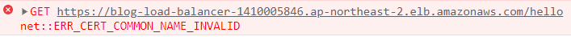
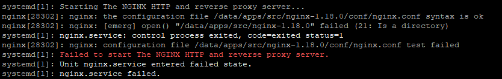
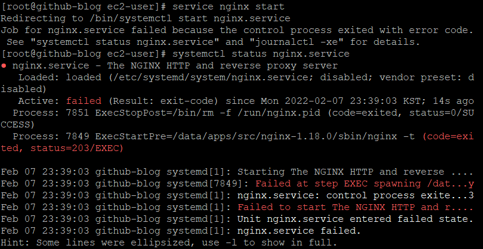
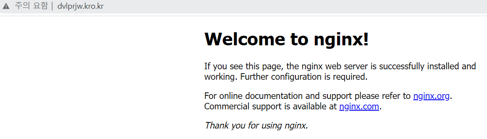
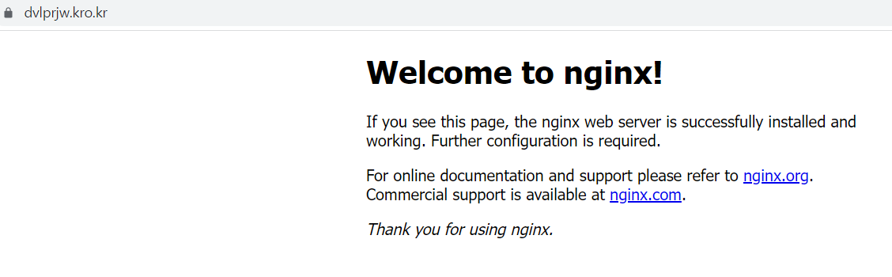

# [Spring Boot 프로젝트] HTTPS 실패

## 과정

### Mixed Content

```
[Github Pages] - [EC2]
```

**스프링 부트와 AWS로 혼자 구현하는 웹 서비스**를 보고 만든 EC2 WAS를 Github Page로 만든 프론트단과 연결하려고 했다.

그리고 `Mixed Content` 에러를 마주했다.

깃헙 페이지는 보안이 적용된 HTTPS 프로토콜을 사용하는데, EC2의 WAS는 HTTP 프로토콜을 사용해서 호환이 되지 않는 문제였다.

이를 해결하려면 EC2의 WAS를 HTTPS로 변경해야 했다.


### SSL 인증서 오류

```
[Github Pages] - [ALB] - [EC2]
```

[freenom](https://www.freenom.com/)을 통해 무료 도메인을 생성하고 이를 AWS에서 제공하는 ACM(SSL 인증서)과 ALB(로드밸런서)를 이용해 HTTPS 프로토콜 세팅을 했더니 다음과 같은 `ERR_CERT_COMMON_NAME_INVALID` 에러가 생겼다.



요청을 보낸 서버 이름과 SSL 인증서의 서버 이름이 달라서 생기는 문제인데, 이를 해결하기 위해 여러 방법을 시도했는데 아직 해결하지 못했다.

**EC2 서버에 직접 SSL을 설치**하면 되지만 해당 도메인은 임시로 사용할 무료 도메인이라 AWS에서 제공하는 기능을 사용해서 해결하고 싶어 다음과 같은 시도를 했었다.


### Nginx

온갖 방법을 시도해도 되지 않아 Nginx를 이용해서 443포트로 들어오는 HTTPS 연결을 처리하려고 했다.

처음에 yum install을 이용해 Nginx를 설치하고 openssl을 통해 SSL 인증서를 EC2에 설치한 후 Nginx를 실행하니 HTTP 접속은 가능하나 HTTPS 접속이 되지 않았다.

http_ssl_module을 추가하고자 삭제한 후 이후부터는 Yum을 사용하지 않고 컴파일 설치를 시도했는데 각종 (2 no such file or directory) 에러, (21: Is a directory) 에러 등이 떠 10번 가까이 삭제와 재설치를 반복했다.

덕분에 Nginx 설치, 환경설정은 어느정도 익숙해졌지만 결국 아직까지 해결하지 못했다.




yum과 certbot을 이용해 시도를 해봐야겠다.


#### yum install nginx

결국 컴파일 설치를 포기하고 다시 yum install nginx를 통해 설치를 했다.

service nginx start를 하니 다음과 같은 **status=203/EXEC** 에러가 떴다.



확인해보니 이전 컴파일 설치를 하면서 nginx.service 파일 설정을 수정했던 게 남아있어서 start 명령을 잘못 잡은 것이었다. sbin 디렉토리의 nginx를 실행시키니 잘 돌아갔고 nginx.service 파일의 세팅값을 현재 상태에 맞게 수정하니 nginx가 돌아갔다.


## HTTPS 적용 성공

https://kerobero.tistory.com/40

위의 블로그를 참고하여 HTTPS 설정을 완료할 수 있었다.



(HTTP)



(HTTPS)


Nginx는 yum으로 설치했으며,

Epel은 amazon-linux-extras로 설치했다. (이걸 설치해야 certbot이 설치됐으며 yum install epel-release를 사용하니 amazon-linux-extras을 사용해 epel이란 이름으로 설치하라는 메시지가 나왔다)

certbot은 yum으로 설치했다.

이후 **certbot certonly --standalone -d [도메인]** 명령어로 SSL 인증서를 받고 (자동으로 /etc/letsencrypt/live/ 디렉토리에 설정한 도메인으로 디렉토리가 하나 더 생기고 그 안에 pem 키가 들어있다) 이를 config 파일의 443번 포트에 적용했다.


이렇게 간단히 할 수 있는 걸 잘 모르는 상태에서 컴파일 설치를 하려고 이것저것 만지는 바람에 너무 오래 걸렸다. 그래도 삽질하면서 설정파일을 계속 오가며 수정한 덕분에 리눅스가 조금 더 익숙해졌다.


### 포트 포워딩

80번, 443번 포트로 접속해도 8080포트로 연결되도록 nginx.conf 파일의 server-loaction 부분을 다음과 같이 수정했다.

```yaml
# 출처 : https://steady-hello.tistory.com/46

server {
    listen       443 ssl;
    server_name  localhost;

    ssl_certificate /etc/letsencrypt/live/dvlprjw.kro.kr/fullchain.pem;
    ssl_certificate_key /etc/letsencrypt/live/dvlprjw.kro.kr/privkey.pem;

	location / {
        # 변경한 부분
        proxy_pass http://localhost:8080;
        proxy_set_header X-Real-IP $remote_addr;
        proxy_set_header X-Forwarded-For $proxy_Add_X_forwarded_for;
        proxy_set_header Host $http_host;
        # 변경한 부분
    }

    #error_page  404              /404.html;
    error_page   500 502 503 504  /50x.html;
    location = /50x.html {
        root   /usr/share/nginx/html;
    }
}
```


## CORS

현재 이루어지고 있는 통신은 다음과 같다.

> [Client] ----- [github.io] ----- [AWS]

이렇게 클라이언트는 github 페이지에 접속했는데, 요청을 AWS로 보냈기 때문에 CORS가 발생했다.


CORS는 Response Header의 Access-Control-Allow-Origin에 허용할 요청의 주소를 넣어 해결할 수 있다.

따라서 Spring-boot의 WebConfig.java 파일에 다음 코드를 추가함으로써 해결했다.

```java
@RequiredArgsConstructor
@Configuration
public class WebConfig implements WebMvcConfigurer {
    private final LoginUserArgumentResolver loginUserArgumentResolver;

    @Override
    public void addArgumentResolvers(List<HandlerMethodArgumentResolver> argumentResolvers) {
        argumentResolvers.add(loginUserArgumentResolver);
    }

    @Override
    public void addCorsMappings(CorsRegistry registry) {
        registry.addMapping("/**")
                .allowedOrigins("http://localhost:3000", "https://parkjeongwoong.github.io");
    }
}
```

