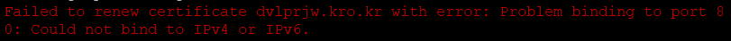

# Certbot 갱신 (ERR_CERT_DATE_INVALID)

프론트-백 간의 HTTPS 통신이 되지 않는 걸 확인하고 백엔드 서버에 접속하니 다음과 같이 "ERR_CERT_DATE_INVALID" 에러가 떴다.

SSL 인증서가 만료됐을 때 뜨는 에러로 EC2에 접속해서 `certbot certificates`를 입력하니 SSL인증서가 5월8일부로 만료됐다는 메시지가 나왔다.

## 해결 과정

0. `sudo certbot --force -renewal` 를 입력해 갱신을 시도

=> "Failed to renew certificate dvlprjw.kro.kr with error: Problem binding to port 80: Could not bind to IPv4 or IPv6."라는 에러가 발생했다.

이는 Certbot은 80번 포트를 사용하는데 80번 포트가 사용 중이라 인증서 갱신에 필요한 통신을 할 수 없다는 뜻이다.

1. `sudo netstat -tnlp` 를 입력해 사용중인 포트와 프로세스를 확인

nginx가 80번 포트와 443포트를 사용하고 있었다. (HTTP와 HTTPS 요청을 nginx로 받기 때문)

2. `sudo nginx -s stop` 로 nginx 종료

3. `sudo certbot --force -renewal` 로 갱신 재시도

=> 성공

4. `/usr/sbin/nginx` 을 실행해 nginx 재실행