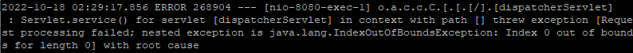

# IndexOutOfBoundsException 에러 & indexOf() 대소문자 구분 없이 비교



검색 기능을 완성하고 나니 일부 단어가 포함되면 검색되지 않는 현상을 확인했다. 특정 영어 단어가 포함되면 검색이 되지 않아 로그를 확인해보니 위와 같은 IndexOutOfBoundsException이 발생한 걸 확인했다.


## IndexOutOfBoundsException

> 리스트 형 객체에서 선언되지 않은 요소에 접근할 때 발생하는 에러

즉 길이가 10일 때, 20번째 요소에 접근하려고 하면 생기는 에러다.

위의 로그에선 length가 0인 빈 리스트에 인덱스 0으로 접근하려다가 문제가 생겼다.


## 원인

원인은 다음과 같았다.

`MariaDB에서는 문자열을 찾을 때 대소문자를 구분하지 않는다.`

그래서 **"trans"라는 문자를 찾는 조건**에서 **"Trans"가 포함된 게시글**이 포함된다.


그런데 `Java의 String.indexOf()는 대소문자 구분을 한다.`

그래서 **"Trans"가 포함된 게시글**에서 "trans"의 **index를 찾으면 아무것도 나오지 않는다.**

그리고 <u>검색 단어의 인덱스를 모아놓은 배열은 빈 배열이 된다.</u>


"trans"가 포함된 게시글 리스트에서 "trans"의 인덱스가 항상 존재한다고 생각했던 게 문제였다.


## indexOf() 대소문자 구분 없이 비교

> 대문자 혹은 소문자로 변환 후 비교

indexOf()를 대소문자 구분 없이 비교하는 간단한 방법은 문자열을 전부 대문자, 소문자로 변환 후 비교하면 된다. (`toUpperCase()` 또는 `toLowerCase()` 사용)


```
toUpperCase() || toLowerCase() => indexOf()
```