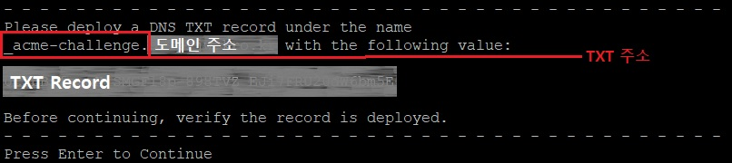

# Certbot, Connection Refused Error (maunal 인증서)

## 상황

1. `sudo certbot renew --force-renew`를 이용해서 갱신을 하려니까 다음과 같은 에러가 발생했다.

```
Cert is due for renewal, auto-renewing...
Could not choose appropriate plugin: The manual plugin is not working; there may be problems with your existing configuration.
...
Attempting to renew cert (도메인주소) from /etc/letsencrypt/renewal/도메인주소.conf produced an unexpected error: The manual plugin is not working; there may be problems with your existing configuration.
...
```

2. 확인해보니 이 에러는 `--manual`을 사용해서 SSL 인증서를 받았을 때 생긴다고 한다.

3. 방법은 인증서를 삭제 후 다시 인증 받는 것.

4. `certbot delete`로 인증서 삭제

5. 그런데 인증이 안 되는 문제 발생

6. `--standalone`도 `--manual`도 안 됨

7. 에러는 `Connection Refused Error`

```
Challenge failed for domain 도메인주소
http-01 challenge for 도메인주소
Cleaning up challenges
Some challenges have failed.

IMPORTANT NOTES:
 - The following errors were reported by the server:

   Domain: 도메인주소
   Type:   connection
   Detail: 39.115.83.55: Fetching
   http://도메인주소/.well-known/acme-challenge/EtO5qqrFc2wpH4gHzZ3AwAgSctiHoAMMvk5SU9YyS1c:
   Connection refused

   To fix these errors, please make sure that your domain name was
   entered correctly and the DNS A/AAAA record(s) for that domain
   contain(s) the right IP address. Additionally, please check that
   your computer has a publicly routable IP address and that no
   firewalls are preventing the server from communicating with the
   client. If you're using the webroot plugin, you should also verify
   that you are serving files from the webroot path you provided.
```

## 해결

다음 글을 보고 해결할 수 있었다. [참고](https://www.lesstif.com/system-admin/dns-txt-record-let-s-encrypt-ssl-59343172.html)

방법은 다음과 같다.

1. `certbot certonly -d 도메인주소 --manual --preferred-challenges dns`

2. IP Logging 허용

3. TXT 주소와 레코드를 확인 후 DNS 서버에 등록

