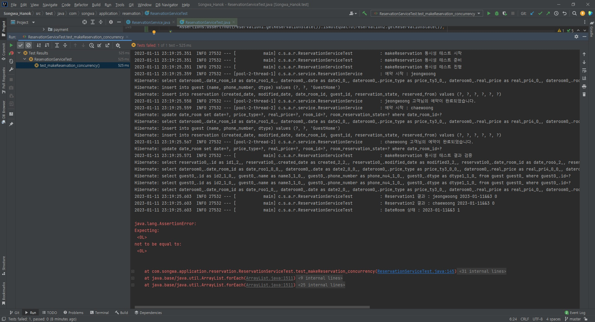

# Java (Spring Boot) 동시성 테스트

```
이 글은 한옥 스테이의 예약 시스템을 만들며 마주한 동시성 문제를 해결한 과정을 다룹니다.
```

## 서론

최근 한옥 스테이에 사용할 예약 시스템을 만들고 있다.

신경 써야 할 부분이 많지만 가장 중요하게 생각한 부분은 동시성 관리였다.

중복 예약이 되는 것은 손님과 숙박업체 모두에게 불편하고 곤란한 상황을 만들기 때문이다.

## synchronized 사용 결과

```java
@Transactional
public synchronized GeneralResponseDto makeReservation(MakeReservationRequestDto requestDto) {
    
    try {

        log.info("예약 시작 : {}", requestDto.getGuestName());

        Guest guest = requestDto.makeGuest();

        DateRoom dateRoom = dateRoomRepository.findByDateRoomId(requestDto.getDateRoomId());
        dateRoom.setStateBooking();

        Reservation reservation = Reservation.builder()
                .dateRoom(dateRoom)
                .guest(guest)
                .build();

        guestRepository.save(guest);
        dateRoomRepository.save(dateRoom);
        long reservationId = reservationRepository.save(reservation).getId();

        log.info("{} 고객님의 예약이 완료되었습니다.", requestDto.getGuestName());
        return GeneralResponseDto.builder()
                .successYN("Y")
                .resultId(reservationId)
                .message("예약에 성공했습니다.")
                .build();

    } catch (RoomReservationException e) {

        log.error("예약된 날짜 에러", e);
        return GeneralResponseDto.builder()
                .successYN("N")
                .message("이미 예약된 날짜입니다.")
                .build();
                
    }

}
```

처음에는 makeReservation 메서드에 단순히 synchronized 키워드를 사용했다.

그리고 다음과 같은 테스트 코드를 이용해 synchronized 키워드를 사용한 makeReservation 메서드를 테스트했다.

```java
@Test
public void test_makeReservation_concurrency() throws InterruptedException {

    log.info("makeReservation 동시성 테스트 시작");

    // Given
    log.info("makeReservation 동시성 테스트 준비");
    int numberOfThreads = 2;
    ExecutorService service = Executors.newFixedThreadPool(numberOfThreads);
    CountDownLatch latch = new CountDownLatch(numberOfThreads);

    String guestName1 = "jeongwoong";
    String guestName2 = "chaewoong";
    String phoneNumber = "010-1234-5678";
    MakeReservationHomeRequestDto requestDto1 = new MakeReservationHomeRequestDto(dateRoom1Id, guestName1, phoneNumber);
    MakeReservationHomeRequestDto requestDto2 = new MakeReservationHomeRequestDto(dateRoom1Id, guestName2, phoneNumber);

    // When
    log.info("makeReservation 동시성 테스트 진행");
    service.execute(() -> {
        reservationService.makeReservation(requestDto1);
        latch.countDown();
    });
    service.execute(() -> {
        reservationService.makeReservation(requestDto2);
        latch.countDown();
    });
    latch.await();

    // Then
    log.info("makeReservation 동시성 테스트 결과 검증");
    List<Reservation> reservations = reservationRepository.findAll();
    DateRoom dateRoom = dateRoomRepository.findByDateRoomId(dateRoom1Id);

    if (reservations.size()>1) {
        Reservation reservation1 = reservations.get(0);
        Reservation reservation2 = reservations.get(1);
        log.info("Reservation1 결과 : {} {} {}", reservation1.getGuest().getName(), reservation1.getDateRoom().getDateRoomId(), reservation1.getReservationState());
        log.info("Reservation2 결과 : {} {} {}", reservation2.getGuest().getName(), reservation2.getDateRoom().getDateRoomId(), reservation2.getReservationState());
        log.info("DateRoom 상태 : {} {}", dateRoom.getDateRoomId(), dateRoom.getRoomReservationState());

        Assertions.assertThat(reservation1.getReservationState()).isNotEqualTo(reservation2.getReservationState());
    }

}
```


그리고...



...결과는 Fail 이었다.

2023년 1월 11일, 0번째 방에 예약이 2개가 걸렸다.


## 개념 정리

동기화를 한다고 단순하게 synchronized를 사용한 게 문제였다.

무엇이 문제였는지 찾기 위해서 관련된 개념들을 찾아봤다.

### synchronized - java

java의 **synchronized 키워드는 스레드를 동기화**할 때 쓰는 기법이다.

이 키워드를 메서드에 쓰면 멀티스레드 환경에서 하나의 스레드만 이 메서드를 동작시킬 수 있다.

그럼 makeReservation 메서드한 한 번에 하나씩만 돌았을텐데 왜 중복 예약이 됐을까?

이상하다.

### 비관적 락

테이블의 **특정 Row에 락을 걸고 다른 트랜잭션이 수정할 수 없게 하는 것**이다.

비관적 락을 사용해서 DateRoom에 락을 걸면 동시성 문제가 해결될 걸로 보였다.

#### PESSIMISTIC_READ

락이 걸린 Row를 **수정/삭제할 수 없지만 읽을 순 있다.**

#### PESSIMISTIC_WRITE

락이 걸린 Row를 **수정/삭제/조회할 수 없다.**

### 낙관적 락

일단 락을 걸고 시작하는 비관적 락과 달리 커밋할 때 JPA의 버전 관리 기능을 이용해서 충돌을 파악한다.

락을 걸지 않기 때문에 성능이 좋지만 충돌이 발생했을 때(ObjectOptimisticLockingFailureException) 직접 예외 처리를 해야 한다.

그리고 낙관적 락은 버전 관리를 하기 때문에 Entity에 @Version 어노테이션을 추가하지 않으면 `"org.hibernate.engine.spi.EntityEntry.getVersion()" is null`이 발생한다.

```java
@Version
private long version;
```

또 이렇게 버전 처리를 하면 Optimistic Lock을 따로 명시하지 않아도 자동으로 Optimistic Lock이 걸린다. (`@Lock(LockModeType.OPTIMISTIC)` 사용 불필요)


## 해결

### PESSIMISTIC_WRITE

**PESSIMISTIC_WRITE**를 다음과 같이 사용하니 바로 해결됐다.

```java
public interface DateRoomRepository extends JpaRepository<DateRoom, String> {
    ...
    @Lock(LockModeType.PESSIMISTIC_WRITE)
    DateRoom findByDateRoomId(String dateRoomId);
    ...
}
```


### OPTIMISTIC

**OPTIMISTIC**을 사용하니 마찬가지로 해결이 됐다.

```java
public interface DateRoomRepository extends JpaRepository<DateRoom, String> {
    ...
    @Lock(LockModeType.OPTIMISTIC)
    DateRoom findByDateRoomId(String dateRoomId);
    ...
}
```

다만 아래와 같은 예외 처리를 추가해줘야 했고

```java
catch (ObjectOptimisticLockingFailureException e) {
    log.error("예약된 날짜 에러(낙관적 락)", e);
    return GeneralResponseDto.builder()
            .successYN("N")
            .message("이미 예약된 날짜입니다.")
            .build();
}
```

테스트 코드 레벨에서 makeReservation 메서드에 try-catch 처리를 안 하면
`UnexpectedRollbackException: Transaction silently rolled back because it has been marked as rollback-only` 예외가 발생하기 때문에 try-catch문을 모두 처리해줘야 했다.

특이점이라고 할만한 게 있었다면 낙관적 락의 특성상 먼저 수정한 사람이 아니라 **먼저 커밋한 사람**에게 우선권을 준다는 점이었다.


### saveAndFlush

synchronized를 쓰면 분명히 동시성이 보장되어야 하는데 안 되는 게 이상했다.

그러다 commit을 하는 시점이 문제일 수도 있다는 생각이 떠올랐다.

#### save

save를 사용하면 JPA는 **쓰기 지연**이 적용된다.
([JPA 영속성 컨텍스트](https://parkjeongwoong.github.io/articles/Web/22) <- 이 글에서 공부했던 내용인데 잊고 있었다.)

즉 효율적인 DB 연결을 위해 한번에 쿼리문을 Flush & Commit 한다.

테스트에선 makeReservation 메서드가 1번째와 2번째까지 실행된 뒤 Flush가 일어났고 이후 3번째와 4번째 고객은 예약이 안 되는 것을 확인했다.

#### saveAndFlush

Entity를 수정한 뒤 바로 flush를 날리려면 saveAndFlush를 사용하면 된다.

```java
@Transactional
public synchronized GeneralResponseDto makeReservation(MakeReservationRequestDto requestDto) {
    
    try {

        log.info("예약 시작 : {}", requestDto.getGuestName());

        Guest guest = requestDto.makeGuest();

        DateRoom dateRoom = dateRoomRepository.findByDateRoomId(requestDto.getDateRoomId());
        dateRoom.setStateBooking();

        Reservation reservation = Reservation.builder()
                .dateRoom(dateRoom)
                .guest(guest)
                .build();

        guestRepository.save(guest);
        dateRoomRepository.saveAndFlush(dateRoom); // <-- 수정
        long reservationId = reservationRepository.save(reservation).getId();

        log.info("{} 고객님의 예약이 완료되었습니다.", requestDto.getGuestName());
        return GeneralResponseDto.builder()
                .successYN("Y")
                .resultId(reservationId)
                .message("예약에 성공했습니다.")
                .build();

    } catch (RoomReservationException e) {

        log.error("예약된 날짜 에러", e);
        return GeneralResponseDto.builder()
                .successYN("N")
                .message("이미 예약된 날짜입니다.")
                .build();
                
    }

}
```

위와 같이 dateRoom 부분의 save를 saveAndFlush로 수정하고 난 뒤에는 동시성 문제가 해결됐다.


## 테스트 결과 비교

네 사람이 동시에 예약했을 때 각 조건 별로 다음과 같은 결과가 나왔다.

1. 비관적 락

```
// 메서드 시작
1번 예약 시작
2번 예약 시작
3번 예약 시작
4번 예약 시작

// DateRoom 예약 상태로 수정
3번 예약 완료
1번 예약 불가
2번 예약 불가
4번 예약 불가
// 메서드 종료

최종 예약 1명 (3번)
```

2. 낙관적 락

```
// 메서드 시작
1번 예약 시작
2번 예약 시작
3번 예약 시작
4번 예약 시작

// DateRoom 예약 상태로 수정
4번 예약 완료
3번 예약 완료
2번 예약 완료
1번 예약 완료
// 메서드 종료

4번 낙관적 락 에러
2번 낙관적 락 에러
3번 낙관적 락 에러

최종 예약 1명 (1번)
```

4번이 먼저 메서드를 끝내며 예약을 완료헸지만 1번이 먼저 커밋

3. 낙관적 락 & saveAndFlush

```
// 메서드 시작
1번 예약 시작
2번 예약 시작
3번 예약 시작
4번 예약 시작

// DateRoom 예약 상태로 수정
2번 예약 완료

1번 낙관적 락 에러
3번 낙관적 락 에러
4번 낙관적 락 에러
// 메서드 종료

최종 예약 1명 (2번)
```

4. synchronized & saveAndFlush

```
// 메서드 시작
1번 예약 시작

// DateRoom 예약 상태로 수정
1번 예약 완료
// 메서드 종료

// 메서드 시작
// DateRoom 예약 상태로 수정
2번 예약 불가
3번 예약 불가
4번 예약 불가
// 메서드 종료

최종 예약 1명 (1번)
```


## 최종 선택

정리된 내용을 바탕으로 내린 결론은 다음과 같다.

- synchronized : 사용하지 않는다. 메서드 자체에 락을 먹이는 거라 **서로 다른 날짜를 동시에 예약하는 경우에도 불필요하게 락이 걸리게 된다.**
- 비관적 락 : 사용하지 않는다. 예약을 하는 과정에서 **충돌이 많을 거라고 예상되지 않기 때문이다.**
- `낙관적 락` : **현재 상황에서 가장 적합한 방법이라고 생각하기 때문에 낙관적 락을 사용해서 동시성을 제어하기로 결정했다.**

사실 한옥 스테이 예약은 어떤 방법을 선택해도 크게 문제가 되지 않을 것 같지만, 혹시나 하는 마음에 이렇게 결론을 내렸다.


## 최종 선택 2

테스트를 하며 다음의 사실을 발견했다.
 - 낙관적 락 & save 테스트
   1. makeReservation 메서드에서 save
   2. makeReservation 메서드를 빠져나온 이후 flush가 일어남
   3. makeReservation 메서드 바깥에서 makeReservation 메서드의 롤백이 실행
   4. UnexpectedRollbackException 예외 발생
   5. 이 예외를 잡기 위해 makeReservation 메서드를 호출하는 test 코드 레벨에서 try-catch 필요

- 낙관적 락 & saveAndFlush 테스트
  1. makeReservation 메서드에서 save & flush
  2. makeReservation 메서드 내부에서 ObjectOptimisticLockingFailureException 발생
  3. makeReservation 메서드 내부의 catch문에서 예외 처리
  4. **일부 makeReservation 외부에서 예외 발생**

=> 테스트 코드가 아니라 API를 통한 호출에서도 문제가 없을까..?란 의문 발생

**이 때문에 낙관적 락을 사용하기 불안했고, 내가 알고 있는 범위 안에서 동작하는 비관적 락을 사용하기로 결정했다.**