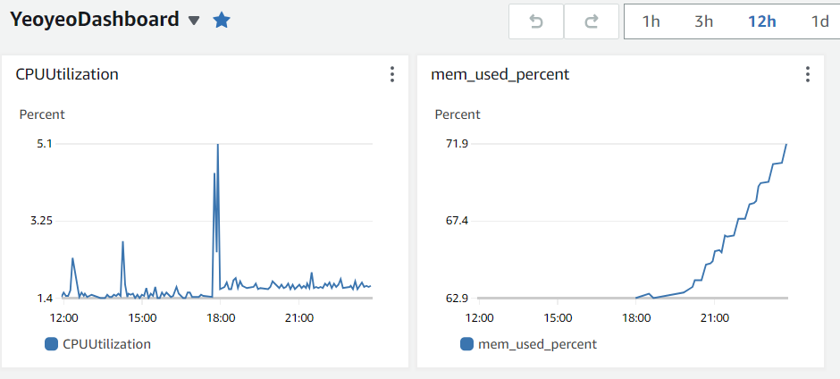

# 비정상적인 메모리 증가, java.lang.NoClassDefFoundError

## [1] CloudWatch 사용

CloudWatch를 이용해 EC2 인스턴스모니터링을 하기 시작했다.

이를 위해 CloudWatchAgent를 설치해야 했는데, 용량이 부족하다는 메시지가 떠 JAR 파일을 일부 삭제하고 CloudWatchAgent를 설치했다.


## [2] 문제 현상



CloudWatch를 설치하고 얼마되지 않아 대시보드에서 이상현상을 발견했다.

메모리가 계단식으로 계속 올라가는 문제였다.


```bash
ps -eo user,pid,ppid,rss,size,vsize,pmem,pcpu,time,cmd --sort -rss | head -n 11
```

를 이용해 확인해보니 한 Spring Application의 메모리가 다른 Spring Application보다 10%가량 더 높은 걸 확인했다.

그리고 로그를 확인해보니 다음과 같은 에러가 엄청나게 찍혀있었다.

```
Exception in thread "http-nio-8092-exec-1208" java.lang.NoClassDefFoundError: ch/qos/logback/classic/spi/ThrowableProxy
        at ch.qos.logback.classic.spi.LoggingEvent.<init>(LoggingEvent.java:119)
        at ch.qos.logback.classic.Logger.buildLoggingEventAndAppend(Logger.java:419)
        at ch.qos.logback.classic.Logger.filterAndLog_0_Or3Plus(Logger.java:383)
        at ch.qos.logback.classic.Logger.log(Logger.java:765)
        at org.slf4j.bridge.SLF4JBridgeHandler.callLocationAwareLogger(SLF4JBridgeHandler.java:221)
        at org.slf4j.bridge.SLF4JBridgeHandler.publish(SLF4JBridgeHandler.java:303)
        at java.logging/java.util.logging.Logger.log(Logger.java:980)
        at java.logging/java.util.logging.Logger.doLog(Logger.java:1007)
        at java.logging/java.util.logging.Logger.logp(Logger.java:1284)
        at org.apache.juli.logging.DirectJDKLog.log(DirectJDKLog.java:175)
        at org.apache.juli.logging.DirectJDKLog.error(DirectJDKLog.java:141)
        at org.apache.tomcat.util.net.NioEndpoint$SocketProcessor.doRun(NioEndpoint.java:1615)
        at org.apache.tomcat.util.net.SocketProcessorBase.run(SocketProcessorBase.java:49)
        at java.base/java.util.concurrent.ThreadPoolExecutor.runWorker(ThreadPoolExecutor.java:1136)
        at java.base/java.util.concurrent.ThreadPoolExecutor$Worker.run(ThreadPoolExecutor.java:635)
        at org.apache.tomcat.util.threads.TaskThread$WrappingRunnable.run(TaskThread.java:61)
        at java.base/java.lang.Thread.run(Thread.java:833)
Caused by: java.lang.ClassNotFoundException: ch.qos.logback.classic.spi.ThrowableProxy
        ... 17 more
```

저 Exception in thread "http-nio-8092-exec-숫자" 부분의 숫자가 계속 올라가고 있었는데 문제가 생겨서 새로운 thread가 계속 쌓이고 있는듯 했다.


https://stackoverflow.com/questions/32477145/java-lang-classnotfoundexception-ch-qos-logback-classic-spi-throwableproxy

https://github.com/spring-projects/spring-boot/issues/4968

Stack Overflow를 확인해보니 Spring 애플리케이션 구동 중 JAR 파일을 삭제했을 때 생기는 에러라는 이야기가 있었고 JAR 파일을 다시 생성하고 새로 배포를 하니 문제가 해결됐다.


## 원인

클래스로더는 실행 시점에 JVM에 필수 클래스(부트스트랩 클래스와 그 확장 클래스)만 먼저 로드하고 나머지 클래스는 런타임 중 필요에 따라 로드한다.

jar 파일에는 컴파일된 class 데이터가 존재하고 클래스로더는 여기서 필요한 클래스를 로드해야 하는데, jar 파일이 사라져서 클래스를 로딩하지 못한 문제였다.

에러 로그에 로깅 관련 내용만 있는 건 AOP를 적용하면서 모든 메서드에는 slf4j를 이용한 메서드 정보가 먼저 찍히다보니 이런 문제가 생긴 걸로 보인다.