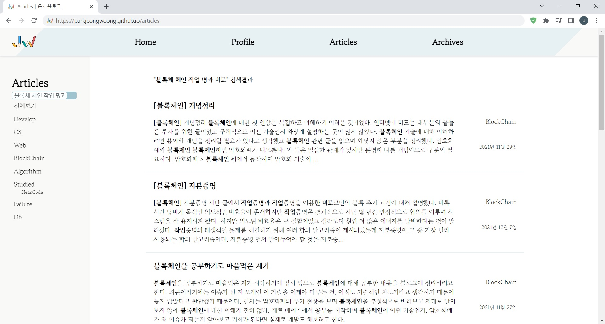

# [GitHub Blog 개발기] 검색 기능 추가

## 검색 기능이 필요했던 이유

초기에는 게시글 중 하나를 찾고 싶을 때 게시글 목록 화면에서 Ctrl+F로 제목을 검색해서 찾았다.

그러다 글이 40개를 넘어가면서 Pagination을 도입했는데, 이러니 한 화면에 모든 게시글이 나오지 않아 글을 쉽게 찾기가 어려워졌다.

뿐만 아니라 오래된 게시글은 제목이 기억나지 않거나 내가 이 내용으로 글을 썼는지 확실히 기억이 안 나는 경우도 있었다.

이런 일들을 겪다보니 내 블로그에도 이젠 검색 기능이 필요하다고 느꼈다.


## 1. LIKE

검색을 가장 간단하게 구현할 수 있는 방법은 LIKE를 사용해서 `게시글 테이블`에 검색어가 있는지 조회하는 방법이다.

### 한계

여러 단어를 검색하기 위해선 보다 나은 방법이 필요했다.


## 2. LIKE OR

한 단어를 검색할 수도, 다섯 단어를 검색할 수도, 열 단어를 검색할 수도 있게 만들려면 동적으로 수정 가능한 쿼리문이 필요했고 기존에 사용하던 Spring Data JPA만으로는 이를 구현하기 힘들었다.

### QueryDSL

검색어에 따른 동적인 쿼리문을 만들기 위해 QueryDSL을 사용했다.

```Java
@Repository
@RequiredArgsConstructor
public class ArticleRepositoryImpl implements ArticleRepositoryCustom {

   private final JPAQueryFactory jpaQueryFactory;

   public List<ArticleSearchResultDto> searchByWords(List<String> words, Long offset) {
      QArticle article = QArticle.article;
      BooleanBuilder builder = new BooleanBuilder();
      words.forEach(word->builder.or(article.content.lower().contains(word)).or(article.title.lower().contains(word)));

      return jpaQueryFactory.selectFrom(article)
               .where(builder).limit(11).offset(offset)
               .fetch()
               .stream().map(ArticleSearchResultDto::new)
               .collect(Collectors.toList());
    }
}
```

이렇게 찾아야 하는 단어 words가 들어오면 BooleanBuilder를 이용해서 OR LIKE 문을 만들어줬다.
(%를 붙여야 하는 like() 대신 contains()를 사용했다.)

### 검색어 강조 처리

검색 결과에 제목만 노출되는 것이 아니라 게시글의 내용도 함께 노출되었으면 했고 검색어와 일치하는 단어는 강조 표시를 하고 싶었다. 이를 위해 검색 결과의 Content에서 검색어와 일치하는 단어를 찾는 매칭 함수를 추가했다.

```java
public void findWord() {
   ...

   for (int i=0;i<this.content.length();i++) this.matchWords.add(false);
   searchWords.forEach(word->findIndexes(word, this.content.toLowerCase(Locale.ROOT)));
}

private void findIndexes(String word, String lowercase_content) {
   int index = lowercase_content.indexOf(word);

   while(index != -1) {
      for (int i=0;i<word.length();i++) {
         this.matchWords.set(index+i, true);
      }
      index = lowercase_content.indexOf(word, index+word.length());
   }
}
```



(검색 결과)

### 한계

N개의 게시글에서 M개의 단어를 검색하려면 N*M 번 데이터를 읽어야 한다. 검색 결과의 우선순위를 정하기 위해 검색 결과 K개의 Content 전체를 M번 읽어야 하고 검색 결과가 Content가 긴 글이라면 부하는 더 늘어나게 된다.

절대 좋은 방법일 수가 없었다.

물론 게시글이 얼마 없는 현재 상황에서 문제될 건 없지만, 문제가 없는 것과 좋은 것은 분명히 다른 것이고 가능한 선에서 가장 좋은 방법을 선택하는 게 옳기 때문에 수정이 필요했다.

임시 방편으로 검색 결과를 10개로 제한했고 검색 결과가 10개보다 많다면 "다음 검색"이 가능하도록 만들었다.

이 방식의 문제는 검색어와 관련있는 게시글이 11번째 이후로 조회가 됐다면 첫 검색 결과에서 제외된다는 것이다. (10개만 조회해서 그 안에서 관련성을 찾으므로)

아무리 생각해도 이상했기 때문에 수정하기로 결정했다.


## 3. 역색인

역색인을 만든다면 더 효율적이라는 것을 알아내고 간단한 역색인을 만들기로 했다.

term, documentId, priorityScore을 컬럼으로 가지는 역색인 테이블을 만들고 게시글을 업로드 할 때 Article 테이블에 저장될 뿐만 아니라 역색인화 작업을 거쳐서 InvertedIndex 테이블에도 저장되도록 만들었다.

가장 좋았던 점은 쿼리문 안에서 우선순위를 찾을 수 있다는 것이었다. 우선순위를 DB에서 가져와서 다시 구해야 했던 이전 방법은 Content를 2번 읽어야 했지만 이 방법은 그럴 필요가 없었다.

더 좋은 검색을 위해선 추가적인 작업이 많이 필요하겠지만 당장 모든 걸 구현할 수는 없기 때문이 당분간은 현 상태에서 만족하기로 했다.

### ElasticSearch

다만 검색 시스템을 개선한다면 추가적인 작업을 만드는 것이 아니라, ElasticSearch라는 검색엔진을 사용하는 방향으로 생각하고 있다.