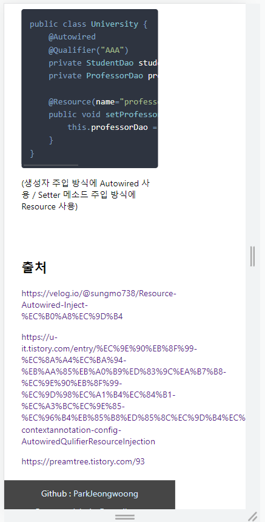
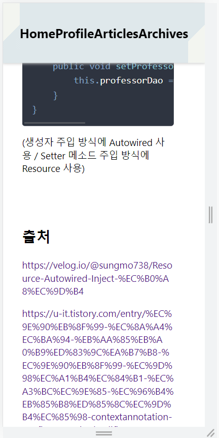

# [TIP] a 태그 줄바꿈 문제



a 태그가 들어간 글은 위와 같이 화면 비율이 제대로 안 맞춰질 수 있다.

이는 a 태그가 inline 요소라서 width 속성이 적용되지 않기 때문이다.


이런 문제는 a 태그의 CSS를 다음과 같이 수정하면 해결된다.

```css
overflow: hidden;
word-break: break-all;
```

(word-break를 break-all로 설정하므로서 default 값인 단어 단위 줄바꿈이 아니라 글자 단위로 줄바꿈을 가능하게 만든다.)



## 출처

https://m.blog.naver.com/PostView.naver?isHttpsRedirect=true&blogId=chyperion&logNo=220542107230