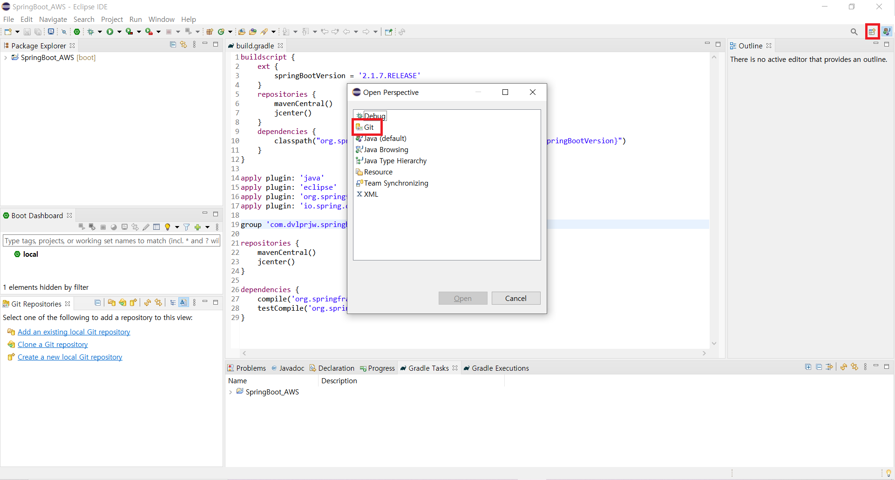
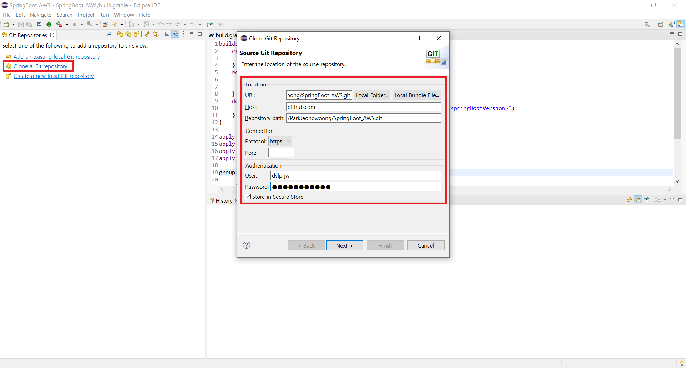
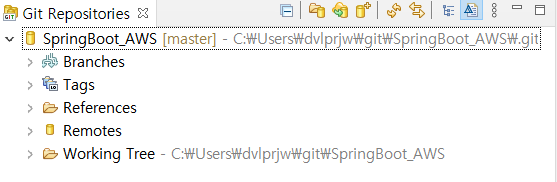

# [Spring Boot 프로젝트] 프로젝트 생성하기 (Eclipse)


백엔드 서버를 만들고 AWS 계정에 올리기 위해 산 [**스프링 부트와 AWS로 혼자 구현하는 웹 서비스**] 책이 오늘 도착했다.

이제부터 틈틈이 이 책을 바탕으로 AWS에 올릴 백엔드 서버를 개발할 예정이다.


(책을 참고하여 상황에 맞게 수정할 계획이므로 책의 내용과 다른 부분이 있을 수 있습니다.)


## 프로젝트 생성

> 책에서는 IntelliJ를 사용했지만 기존에 있던 Eclipse를 사용하기로 했다.

**Spring starter Project**를 사용하면 손 쉽게 스프링 부트 프로젝트를 만들 수 있다. (참고. [2. SpringBoot 프로젝트 생성(이클립스)](https://jung-max.github.io/2020/06/24/Web-2_SpringBoot%ED%94%84%EB%A1%9C%EC%A0%9D%ED%8A%B8%EC%83%9D%EC%84%B1/)) 하지만 이 프로젝트는 공부를 겸하는 프로젝트이기 때문에 책의 내용을 따라 **Gradle Project를 만들고 필요한 설정을 build.gradle에 하나씩 직접 추가**하면서 진행할 계획이다.


### 1. Gradle Project 생성

```
New - Project - Gradle Project - 프로젝트 이름 입력 - Finish
```

위의 과정을 거치면 바로 Gradle 기반의 Java 프로젝트가 생성된다.


### 2. build.gradle

생성 직후의 build.gradle 파일은 다음과 같다.

```json
plugins {
    id 'java-library'
}

repositories {
    jcenter()
}

dependencies {
    api 'org.apache.commons:commons-math3:3.6.1'

    implementation 'com.google.guava:guava:28.2-jre'

    testImplementation 'junit:junit:4.12'
}
```

이 코드를 다음과 같이 바꾸고 **Gradle - Refresh Gradle Project**를 한다.

```json
buildscript {
	ext {
		springBootVersion = '2.1.7.RELEASE'
	}
	repositories {
		mavenCentral()
	    jcenter()
	}	
	dependencies {
		classpath("org.springframework.boot:spring-boot-gradle-plugin:${springBootVersion}")
	}
}

apply plugin: 'java'
apply plugin: 'eclipse'
apply plugin: 'org.springframework.boot'
apply plugin: 'io.spring.dependency-management'

group 'com.dvlprjw.springboot_aws'

repositories {
	mavenCentral()
    jcenter()
}	

dependencies {
	compile('org.springframework.boot:spring-boot-starter-web')
	testCompile('org.springframework.boot:spring-boot-starter-test')
}
```


### 3. Git 연동



1) 우상단의 Open Perspective -> Git




2) clone a Git repository - 내용 입력 후 Next - Next- Finish




3) Git Repository에 프로젝트 생성


## 출처

- 스프링 부트와 AWS로 혼자 구현하는 웹 서비스