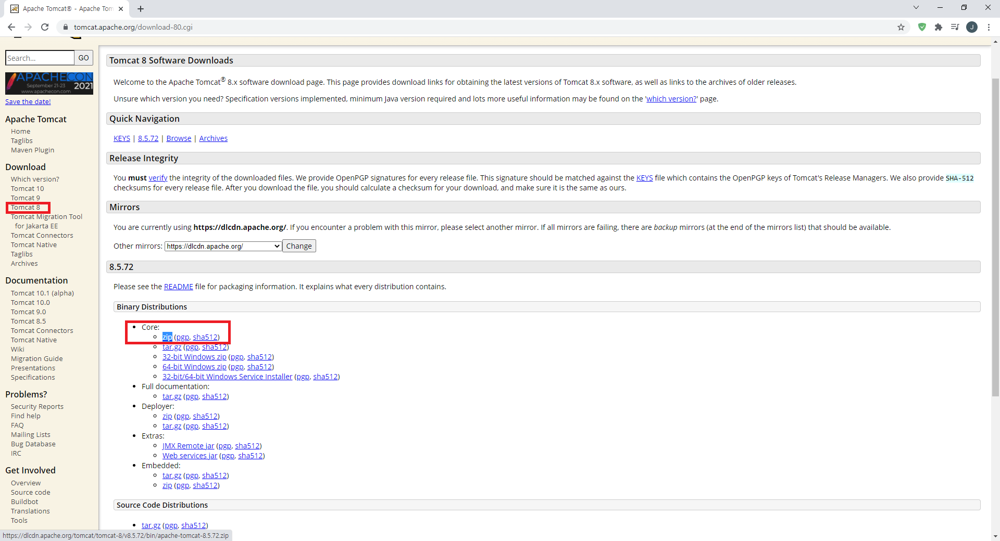
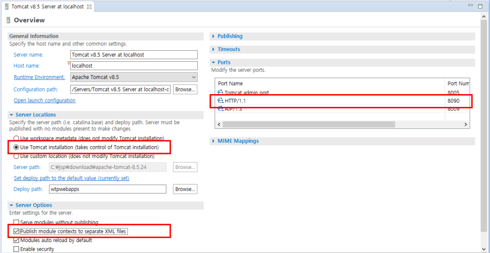
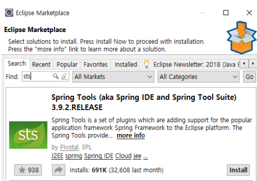

# [Spring] Spring Project 시작

스프링을 다루다보면 톰캣(Tomcat)에 대한 이야기를 많이 듣습니다.

톰캣이란, **자바 서블릿을 실행시키고 JSP 코드로 웹 페이지를 만들어주는 동적 웹컨테이너(Web Application Service)로** `스프링으로 웹 서버를 만들기 위해 필요한 서버`입니다.

오늘은 톰캣을 이클립스에 연동시키고 스프링 프로젝트로 웹 서버를 시작하는 방법을 알아보겠습니다.

## Tomcat

### 다운로드

http://tomcat.apache.org/

`Tomcat 8` - `Binary Distributions` - `Core` - `zip`

### 이클립스 연동

이클립스를 열고 화면 아래에 **Servers **탭을 확인합니다.

톰캣

- 만약 **Servers **탭이 없다면?

  → `Window` - `Show View` - `Other` - `Servers` - `Open` 클릭

- **이클립스에 사용 가능한 서버가 없다고 뜬다면?**

  → `문구 클릭` - `다운로드 받은 Tomcat 버전 선택` - `압축 해제한 폴더 경로로 선택` - `사용 중인 JRE 선택` - `Finish` 클릭

- 톰캣 서버가 정상적으로 존재한다면 OK

### 서버 설정

**Servers **탭을 더블 클릭 → 설정 화면 진입

- **Server Locations** : `Use Tomcaet installation`
- **Server Options** : `Publish module contexts to separate XML files` 체크
- **Ports** : HTTP/1.1 포트를 8090으로 변경 (DB를 오라클로 쓰면 오라클이 포트를 8080으로 자동으로 가져가면서 충돌이 생깁니다)

- 아래 초록색 Run 버튼 옆의 `Publish to the server` 클릭 → <u>톰캣이 관리하는 경로에 프로젝트 파일을 복사</u>함으로써 프로젝트와 웹서버를 연동
  - **workspace\프로젝트** 폴더에 있는 프로젝트는 개발자가 관리하는 파일, 웹서버로 배포하려면 톰캣이 이 프로젝트를 복사해서 배포용으로 관리하는 경로(**workspace\.metadata** 폴더에 존재)로 옮겨야 합니다.

- **Server 구동**
  - 이후 localhost:8090으로 접속하면 톰캣 시작 창이 뜰 것입니다.

## STS

웹서비스를 구현하려면 **web.xml**, **dispatcher servlet**, **pom.xml** 등의 작업을 처리해야 합니다.

이런 작업을 매번 일일이 하는 일은 피곤한 일이므로 이런 <u>기본 설정을 자동으로 세팅해 주는 Plugin</u>이 있는데, 바로 **STS** 입니다.

### 이클립스 - STS

### 설치

`Help` - `Marketplace` - `Spring Tools / STS` - **설치 진행** (설치 중간에 선택이 안 되어 있는 항목이 있으면 전부 선택해 줍니다)

### 웹프로젝트 생성

`New` - `Other` - `Spring Legacy Project` - `Spring MVC Project` (Spring MVC Projects 관련 파일 다운로드 창이 뜬다면 Yes 클릭)

- 이 때 패키지 명은 유니크하고 2단계 이상의 이름으로 짓습니다 (ex. **com.jw.test.pjt001**)

### 서버 실행

- 프로젝트를 우클릭하고 **Run As - Run on Server**를 선택해서 실행합니다.
- 이후 locahost:8090에 접속하면 Tomcat을 통해 실행된 Spring Project를 볼 수 있습니다.

## 출처

인프런 - 자바 스프링 프레임워크(renew ver.) - 신입 프로그래머를 위한 강좌

https://jsp-making.tistory.com/423

