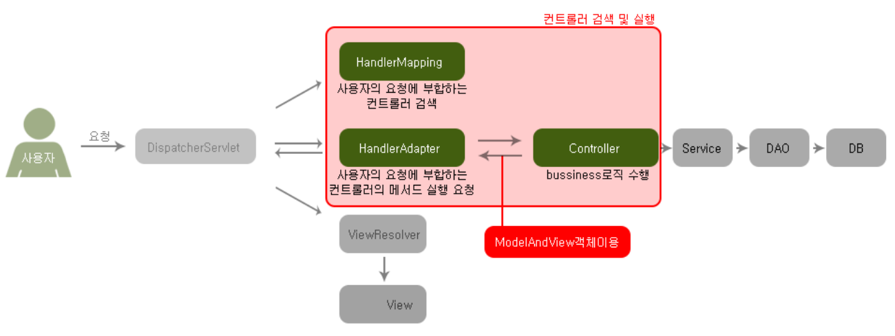

# [Spring] Spring Project 구조

오늘은 STS를 통해 Spring MVC Project를 생성하면 만들어지는 파일 구조를 알아보겠습니다.


## 전체 구조

```
[src]
	[main]
		[java]								 	: java 파일 위치, 패키지로 묶어서 관리, Controller, Service, DAO 객체들이 위치
		[resources]
		[webapp]								 : 웹 관련 폴더 (스프링 설정파일, JSP파일, HTML 파일 등)
			[resources]							 : html, css, js 파일 등
			[WEB-INF]
				[classes]
				[spring]						 : 스프링 컨테이너를 생성하기 위한 스프링 설정 파일
					[appServlet]
						servlet-context.xml
				[views]							 : View로 사용될 JSP 파일
					home.jsp
				web.xml							 : 웹 설정 파일
	[test]
[target]
pom.xml											 : 프로젝트에 필요한 라이브러리를 내려받기 위한 메이브 설정 파일
```


### web.xml

`웹 설정 파일`


웹어플리케이션에서 최초 사용자의 요청은 **DispatcherServlet**이 가장 먼저 받고 처리합니다.

=> (1) <u>따라서 web.xml에는 DispatcherServlet이 서블릿으로 등록</u>되어있으며,

=> (2) 모든 경로의 요청을 받기 위해 <u>Servlet의 Mapping은 "/"로 설정</u>되어 있습니다.

```xml
<servlet>
	...
    <servlet-class>org.springframework.web.servlet.DispatcherServlet</servlet-class> (1)
    ...
</servlet>

<servlet-mapping>
	...
    <url-patter>/</url-patter> (2)
    ...
</servlet-mapping>
```


### DispatcherServlet

`클라이언트의 요청을 받고 처리하는 영역`



- HandlerMapping 객체 : **Controller** 탐색
- HandlerAdpater 객체 : **Method** 탐색 / ModelAndView 객체를 Dispatcher 객체에 반환
  - Controller 객체 : 작업 수행 후 **ModelAndView** 객체 반환
    - ModelAndView 객체 : 응답에 필요한 Data와 View (JSP 파일)


### servlet-context.xml

`스프링 설정을 해주는 파일`

클래스로부터 **객체(bean)을 생성&조립**하는 역할입니다.


web.xml 파일에 contextConfigLocation 라는 이름으로 경로가 지정되어 있습니다.

 ```xml
<servlet>
	...
    <init-param>
    	<param-name>contextConfigLocation</param-name>
        <param-value>/WEB-INF/spring/sppServelt/servlet-context.xml</param-value>
    </init-param>
    ...
</servlet>
 ```

(web.xml)


### Controller

>  [Controller - Service - DAO] -> 사용자의 요청을 실제로 처리하는 객체들입니다.

- `@Controller` 어노테이션을 통해 **컨트롤러 클래스를 지정**합니다.

- `@RequestMapping(Value = "/", method = RequestMethod.GET)` 을 통해 **요청 경로와 메소드 매핑**합니다.

- <u>Method가 반환하는 문자열</u>은 **View로 사용될 JSP파일의 이름**입니다.

```java
@Controller
public class HomeController {
    
    ...
        
    @RequestMapping("/success")
    public String success(Model model) {
        return "success" // JSP 파일 이름
    }
    
}
```


### View

`사용자에게 화면을 출력하는 요소`

**JSP** 파일 실행 (Java 언어를 이용해 View 응답을 할 수 있는 유일한 방법은 JSP 페이지)


## 추가!

JSP 파일을 사용한 Veiw 페이지로 응답하고 싶지 않다면??

- Method에 `@ResponseBody`라는 어노테이션을 붙이면 **return 값을 그대로 반환**
- 이후 spring-servlet.xml 파일과 pom.xml 파일을 수정하여 원하는 방식으로 값을 출력할 수 있습니다.


## 출처

인프런 - 자바 스프링 프레임워크(renew ver.) - 신입 프로그래머를 위한 강좌

https://victorydntmd.tistory.com/172
