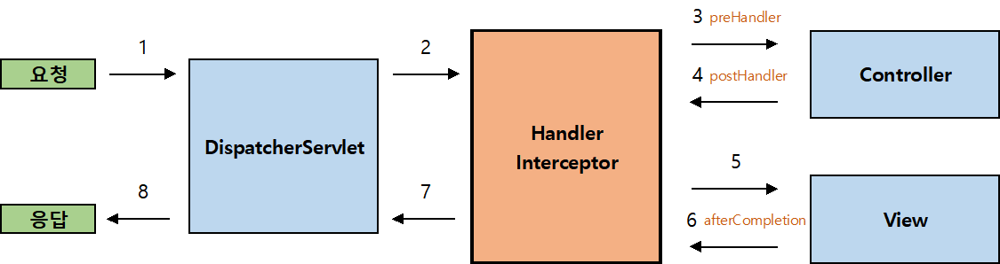

# [Spring] 리다이렉트 & 인터셉터

접근 권한이 없거나 페이지가 존재하지 않는 등 사용자가 요청한 URL이 아닌 다른 URL로 페이지를 이동시켜야 할 때가 있습니다.

이렇게 특정 조건을 만족할 때 URL을 이동시키기 위해 사용할 수 있는 것이 **Redirect**와 **Intercept**입니다.


## 리다이렉트

> return "redirect:주소";

Redirect는 Controller의 Method 내부에서 **View를 분기하는 방법**입니다.

조건에 따라 다른 Return 값을 설정함으로써 구현하는데 일반적으로 return하는 값은 `"View의 이름"`이지만 리다이렉트는 단순히 View만 마꾸는 것이 아니라 주소 자체를 이동시켜야 하기 때문에 `"redirect:이동할 주소"`를 return시킨다는 차이점이 있습니다.


```java
@Controller
@RequestMapping("/member")
public class MemberController {
    
    ...
    
    @RequestMapping(value="/modifyForm")
	public String modifyForm(Model model, HttpServletRequest request) {
    
    	HttpSession session = request.getSession();
	    Member member = (Member) session.getAttribute("member");
    
    	if (member == null)
    		return "redirect:/"; // 사용자를 '/'를 주소로 리다이렉트 시킵니다.

	    model.addAttribute("member", service.memberSearch(memver));
    
    	return "/member/modifyform"; // webapp - WEB-INF - view - member 위치에 있는 modifyform.jsp 파일을 View로 반환합니다.
	}
    
    ...
    
}
```


## 인터셉터

> public class MemberLoginInterceptor extends HandlerInterceptorAdapter {
>
> ​	@Override
>
> ​	public boolean preHandle(...) {...}
>
> }

Handler Interceptor는 DispatcherServlet과 Controller(Handler) 사이에서 <u>Controller 실행 전/후</u>에 **HttpRequest**와 **HttpResponse**를 가로채는 역할을 합니다.

로그인을 해야만 접근할 수 있는 페이지를 리다이렉트만으로 구현하려면 각 메서드마다 로그인 여부를 확인하고 리다이렉트를 결정하는 코드가 필요합니다. 페이지의 수가 적다면 괜찮겠지만 굉장히 많거나 서비스가 발전하며 늘어난다면 굉장히 많은 중복 코드가 생기게 됩니다.

인터셉터(일반적으로 많이 사용하는 Request를 가로채는 preHandler)는 Controller에 진입하기 전에 HttpRequest를 먼저 확인하기 때문에 여기서 로그인 여부를 확인하면 코드의 중복을 줄이고 확장성을 높일 수 있습니다.





### 인터셉터의 종류

- preHandle() : Controller 전 **\*가장 많이 쓰임 (redirect 대체)**
- postHandle() : Controller 후
- afterCompletion() : View까지 작업 후


### 인터셉터의 사용

#### Interceptor Class 구현

인터셉터를 구현하기 위해서는 Interceptor 클래스를 만들고 **HandlerInterceptor**, **HandlerInterceptorAdapter** 중 하나를 선택하여 상속합니다.

- **HandlerInterceptor** : 인터페이스 - `implement` 사용
- **HandlerInterceptorAdapter** : 추상 클래스 - `extends` 사용 (<u>메서드가 구현되어 있어서 편리하기 때문에 많이 사용</u>)


[**HandlerInterceptor**]

```java
public class MemberLoginInterceptor extends HandlerInterceptorAdapter {

	@Override
	public boolean preHandle(HttpServletRequest request, HttpServletResponse response, Object handler) throws Exception {
		
		HttpSession session = request.getSession(false);
        
		if (session != null) {
            Object obj = session.getAttribute("member");
            if (obj != null)
                	return true
        }
        
		response.sendRedirect(request.getContextPath() + "/");
		
        return false;
	
    }
	
	@Override
	public void postHandle(HttpServletRequest request, HttpServletResponse response, Object handler, ModelAndView modelAndView) throws Exception {
		
		super.postHandle(request, response, handler, modelAndView);
        
	}
	
	@Override
	public void afterCompletion(HttpServletRequest request, HttpServletResponse response, Object handler, Exception ex) throws Exception {
		
		super.afterCompletion(request, response, handler, ex);
        
	}
    
}
```

인터페이스이기 때문에 모든 메서드를 구현합니다.


[**HandlerInterceptorAdapter**]

```java
public class MemberLoginInterceptor extends HandlerInterceptorAdapter {
    
    @Override
    public boolean preHandle(HttpServletRequest request, HttpServletResponse response, Object Handler) throws Exception {
        
        HttpSession Session = request.getSessiont(false);
        if (session != null) {
            Object obj = session.getAttribute("member");
            if (obj != null)
                	return true
        }
        
        response.sendRedirect(request.getContextPath() + "/");
        return false;
            
    }
    
}
```

필요한 메서드만 구현합니다.


#### 스프링 설정파일 등록

구현한 Interceptor가 동작하기 위해서는 스프링 설정 파일에 Interceptor를 등록해야 합니다.

```xml
<interceptors>
	<interceptor>
        <!-- path="/**"를 사용하면 모든 경로를 가로챕니다 -->
    	<mapping path="/member/modifyForm"/>
        <mapping path="/memver/removeForm"/>
        <beans:bean class="com.jw.lec21.member.MemberLoginInterceptor"/>
    </interceptor>
</interceptors>
```

Interceptor 태그에는 <u>요청을 가로채서 넣을 Bean 객체의 위치를 등록</u>하고 <u>요청을 가로채는 범위(Interceptor가 동작하는 경로)를 mapping</u> 시킵니다.


## 출처

인프런 - 자바 스프링 프레임워크(renew ver.) - 신입 프로그래머를 위한 강좌

https://victorydntmd.tistory.com/176

https://kimvampa.tistory.com/127

https://to-dy.tistory.com/21
