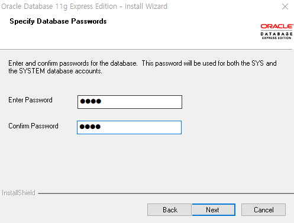
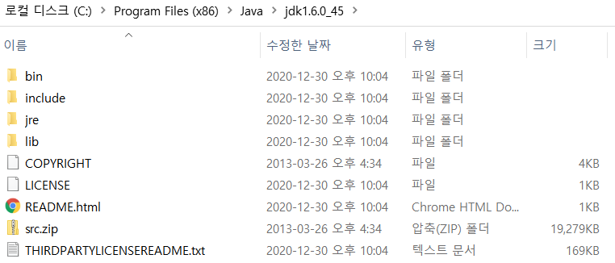
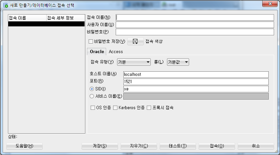

# [Spring] Database

오늘은 데이터베이스를 설치하는 방법을 알아보겠습니다.

(가장 많이 사용하는 RDBMS인 Oracle과 MySQL을 기준으로 설명하겠습니다.)

## Oracle & MySQL

Oracle과 MySQL은 비슷하면서도 다른 관계형 데이터베이스 관리 시스템(RDBMS; Relational DataBase Management System)입니다.

Oracle은 규모가 큰 기업을 위해 설계된 DBMS이고 MySQL은 일반적인 규모에서 사용하기 위해 설계된 DBMS입니다. 보통 대기업은 오라클을 많이 사용하고 자체 서비스 기업이나 스타트업은 MySQL을 사용하는데, 두 DBMS 간에 문법이 조금 다른 부분이 있긴 하지만 대부분 비슷한 문법을 공유하기 때문에 둘 중 어떤 DBMS로 시작하더라도 상관없습니다.

## Oracle

### 설치

오라클을 사용하기 위해서 아래의 주소에서 설치 파일을 다운 받습니다.

http://www.oracle.com/technetwork/database/database-technologies/express-edition/downloads/index.html

설치 중간에 **비밀번호 설정 (Specify Database Passwords)** 창이 나오는데 system 로그인을 할 때 필요하므로 잊지 않도록 주의합니다.

Next - Install 버튼을 눌러 설치를 완료합니다.

### 계정 관리

오라클 DB의 계정을 관리하는 방법은 **명령 프롬프트**와 **SQL Developer**를 이용해 할 수 있습니다.

#### 명령 프롬프트

[**계정 생성**]

1. 윈도우 명령 프롬프트를 실행합니다.
2. sqlplus를 입력하여 오라클을 실행합니다.
3. 관리자 계정으로 로그인하기 위해 user-name과 password를 입력합니다.
   - user-name : `system`
   - password : `설치할 때 자신이 설정한 비밀번호`
4. 유저 계정을 생성합니다.
   - `create user 유저이름 identified by 비밀번호;`
5. exit을 입력해 sqlplus를 종료합니다.
6. 다시 sqlplus를 입력해서 오라클을 실행합니다.
7. 방금 만들었던 유저 계정의 username, passowrd 입력하여 계정이 잘 생성 되었는지 확인합니다.

[**계정 삭제**]

1. 관리자 계정으로 로그인합니다.
2. 삭제할 계정을 명령어에 넣어 계정을 삭제합니다.
   - `drop user 유저명 cascade;`

#### SQL developer

프롬프트 창으로 Oracle을 다루다보면 불편할 때가 많습니다. 다행히 Oracle 사에서는 이런 불편함을 개선할 수 있는 SQL developer라는 SQL 작업을 위한 통합 개발 환경을 제공합니다.

[**설치**]

SQL Developer는 별도의 프로그램이기 때문에 따로 설치를 해야 합니다.

먼저 아래의 주소에서 SQL developer 설치 파일을 다운로드 합니다.

http://www.oracle.com/technetwork/developer-tools/sql-developer/downloads/index.html

[**JDK 경로 설정**] - 첫 실행

처음 설치하고 실행하면 설치된 Java(JDK) 경로를 설정해야 합니다. (Java 폴더 안의 jdk 파일의 위치를 설정합니다)

(이 위치를 jdk 경로로 설정)

[**접속**]

1. 새로운 접속(로그인)을 하기 위해서 왼쪽 접속 메뉴에서 접속을 우클릭, 이후 '새 접속'을 클릭합니다.
   - `접속` - `우클릭` - `새 접속`

2. '새로 만들기/데이터베이스 접속 선택'이 나오면 위에서 만들었던 사용자 계정을 입력합니다.
3. <u>테스트</u>를 해서 상태가 성공으로 나오면 <u>저장</u>을 합니다.
4. 저장된 이름을 클릭하고 <u>접속</u> 버튼을 클릭합니다.

## MySQL

### 설치

MySQL을 사용하기로 결정했으면 마찬가지로 설치를 해야 합니다.

1. 먼저 아래의 페이지에 접속해서 Community 버전을 선택합니다. (찾는 게 귀찮다면 아래의 다운로드 링크를 클릭해도 됩니다)
   - https://www.mysql.com/downloads/ 

2. `MySQL Commuinity Server`을 다운로드 합니다. (다운로드 링크 : [MySQL Community Server](https://dev.mysql.com/downloads/mysql/))

3. `Go to Download Page`를 클릭합니다.

4. 용량이 큰 일반 버전을 다운로드 받습니다.

5. 다운로드 후 설치를 진행하면 포트 번호 설정하는 화면이 나옵니다. 기본 포트 번호 3306으로 진행합니다.

   (MySQL의 기본 포트 번호는 3306, Oracle의 기본 포트 번호는 1521)

6. 관리자 계정에서 사용할 비밀번호를 입력합니다.
7. **Connect To Server**화면이 나오면 관리자 계정을 입력하고 계속 진행하여 설치를 마무리합니다.
   - User : `root`
   - Password : `설치할 때 자신이 설정한 비밀번호`

###  MySQL Workbench

오라클에서 SQL developer를 사용해 DB를 관리하는 것 처럼 MySQL은 **MySQL Workbench**라는 DB 관리 툴이 있습니다.

워크벤치는 SQL developer와 다르게 별도로 설치할 필요 없이 MySQL을 설치할 때 함께 설치되기 때문에 바로 사용할 수 있습니다.

## 출처

인프런 - 자바 스프링 프레임워크(renew ver.) - 신입 프로그래머를 위한 강좌

https://victorydntmd.tistory.com/145

https://velog.io/@joajoa/MySQL-%EB%8B%A4%EC%9A%B4%EB%A1%9C%EB%93%9C-%EB%B0%8F-%EC%84%A4%EC%B9%98-%EB%B0%A9%EB%B2%95
