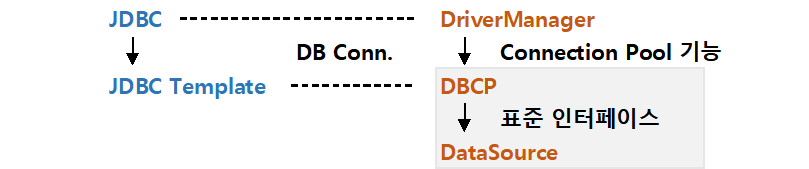

# [Spring] Connection Pool과 JDBC Template

JDBC Interface는 편리한 도구이지만 몇 가지 불편한 점이 있습니다.

하나는 같은 코드를 반복해서 쓴다는 것이고 다른 하나는 매번 드라이버를 로드해 데이터베이스와 연결시키고 Connection 객체를 생성한다는 것입니다.

오늘은 이런 문제를 해결하는 방법인 Connection Pool과 JDBC Template을 소개하겠습니다.


아래는 기존 JDBC Interface를 이용하여 DAO 클래스 안에 구현한 Insert 메소드 예시 코드입니다.

```java
private String driver = "oracle.jdbc.driver.OracleDriver";
private String url = "jdbc:oracle:thin:@localhost:1521:xe";
private String userid = "scott";
private String userpw = "tiger";

private Connection conn = null;
private PreparedStatement pstmt = null;
private ResultSet rs = null;

@Override
public int memberInsert(Member member) {
	
    int result = 0;
	
    try {
        Class.forName(driver);
        conn = DriverManager.getConnection(url, userid, userpw);
        // SQL 관련 부분
        final String sql = "INSERT INTO member (memId, memPw, memMail) values (?,?,?)";
        pstmt = conn.prepareStatement(sql);
        pstmt.setString(1, member.getMemId());
        pstmt.setString(2, member.getMemPw());
        pstmt.setString(3, member.getMemMail());
        result = pstmt.executeUpdate();
        // SQL 관련 부분 끝
    } catch (ClassNotFoundException e) {
        e.printStackTrace();
    } catch (SQLException e) {
        e.printStackTrace();
    } finally {
        try {
            if(pstmt != null) pstmt.close();
            if(conn != null) conn.close();
        } catch (SQLException e) {
            e.printStackTrace();
        }
    }
	
    return result;

}
```

JDBC와 DriverManager를 사용해서 데이터베이스에 접근하는 위의 코드는 다음과 같은 문제점이 있습니다

1. 데이터베이스에 접속할 때마다 새로운 Connection 객체를 만들기 때문에 접속량이 많아지면 서버에 큰 부하를 일으키게 됩니다.
2. Insert, Update 등 데이터베이스에 접근하는 모든 메소드마다 드라이버 로딩, 연결, 자원 해제 코드를 작성하는 구조적인 반복이 발생합니다.


## Connection Pool

> DB 연결을 미리 준비해 놓고 사용하는 방법

데이터베이스에 접속할 때마다 매번 연결을 하고 Connection 객체를 만드는 일은 비효율적이고 서버에 부하를 일으키는 방식입니다.

Connection Pool은 WAS가 실행될 때 여러 개의 Connection을 미리 만들어 Pool에 저장해두고, 요청이 들어오면 Pool에 있던 Connection을 제공하고 처리가 끝나면 다시 반납받아 Pool에 저장하는 기법입니다.


Connection Pool을 사용하면 **빠르게 데이터베이스에 접속이 가능**하고, Connection 객체의 수가 제한되어 있어 접속량이 많더라도 **서버 자원을 필요 이상으로 사용하지 않기** 때문에 Connection Pool은 대규모 웹 서비스를 제공할 때 필수적인 요소입니다.


[장점]

1. 미리 연결이 되어있기 때문에 빠르게 DB 접속 가능
2. DB 연결 수 제한으로 서버 자원 고갈 방지
3. DB 접속 모듈 공통화로 편리한 유지보수
4. Connection 객체를 새로 만드는 비용 절약


### DataSource

효율적인 데이터베이스 연결을 위한 Connection Pool, 즉 DBCP (Database Connection Pool) 기능으로 구현한 구현체들이 많이 생겼지만 표준이 없었기 때문에 구현체마다 내용이 달라 관리가 어려웠습니다. DataSource Interface는 이런 문제를 해결하기 위해 만들어진 DBCP 구현체들의 표준입니다.

> The **DataSource** interface is implemented by a driver vendor. There are three types of implementations:
>
> 1. Basic implementation -- produces a standard **Connection** object
> 2. Connection pooling implementation -- produces a **Connection** object that will automatically participate in connection pooling. This implementation works with a middle-tier connection pooling manager.
> 3. Distributed transaction implementation -- produces a **Connection** object that may be used for distributed transactions and almost always participates in connection pooling. This implementation works with a middle-tier transaction manager and almost always with a connection pooling manager.

[[출처](https://docs.oracle.com/javase/7/docs/api/javax/sql/DataSource.html)]

DataSource 인터페이스에는 Connection 객체 생성과 Connection Pool에 대한 내용이 있습니다.

DataSource는 Conection Pool을 통해 DriverManager를 한 단계 더 추상화 한 형태입니다. DriverManager는 실질적인 접속을 생성하며 close 메소드는 실제 접속을 종료하지면 DataSource는 논리적인 접속을 생성하며 close 메소드는 실제 접속을 종료하는 것이 아니라 Connection Pool로 관리하고 있는 접속 중 하나를 논리적으로 종료합니다.


❗ DataSource는 Java의 표준으로 지정되어 있어서 사용법이 동일하지만 Connection Pool의 표준은 없기 때문에 Connection Pool은 라이브러리에 따라 달라집니다.

❗ 스프링에서 제공하는 **org.springframework.jdbc.datasource.DriverManagerDataSource**는 Connection Pool 기능이 없는 개발 단계에서만 사용 가능한 DataSource입니다.


#### DBCP 구현체

DBCP를 구현한 라이브러리의 종류

- [**Apache Commons DBCP**](https://commons.apache.org/proper/commons-dbcp/)
- [**HikariCP**](https://github.com/brettwooldridge/HikariCP )
- [**c3p0**](https://github.com/swaldman/c3p0 )


## JDBC Template

> JDBC Template은 이런 JDBC의 구조적인 반복을 줄이기 위한 클래스

Java에서 제공하는 JDBC를 사용한 기존 코드는 SQL문과 관련된 부분을 제외하고 **드라이버 로딩, DB 연결, 자원 해제** 부분이 반복됩니다.

JDBC Template은 이런 구조적인 반복을 줄이고 개발자가 SQL문만 작성하도록 만들어 생산성과 유지보수성을 높이기 위해 Spring Framework에서 제공하는 클래스입니다. 

JDBC Template은 Driver를 논리적인 레벨에서 다루기 때문에 DriverManager가 아닌 DataSource를 주입해서 사용합니다.


- **DataSource - No Connection Pool**
  - c3p0 : **com.mchange.v2.c3p0.DriverManagerDataSource**
  - 스프링 : **`org.springframework.jdbc.datasource.DriverManagerDataSource**
- **DataSource - With Connection Pool**
  - c3p0 : **com.mchange.v2.c3p0.ComboPooledDataSource**
  - dbcp : **org.apache.commons.dbcp.BasicDataSource**


## 사용하기

### JDBC Template

#### 의존설정 추가 (pom.xml)

```xml
<!-- 오라클을 사용하는 경우 : 메이븐 레파지토리에 없는 오라클 Driver 관리를 위한 오라클 레파지토리 추가 -->
<repositories> <!-- 기존 -->
	<repository>
    	<id>oracle</id>
        <name>ORACLE JDBC Repository</name>
        <url>http://maven.jahia.org/maven2</url>
    </repository>
</repositories>

...

<!-- DB -->
<dependency> <!-- 기존 -->
	<groupId>com.oracle</groupId>
    <artifactId>objdbc6</artifactId>
    <version>12.1.0.2</version>
</dependency>
<dependency> <!-- 스프링에서 제공하는 JDBC 추가 -->
	<groupId>org.springframework</groupId>
    <artifactId>spring-jdbc</artifactId>
    <version>4.1.6.RELEASE</version>
</dependency>
<dependency> <!-- C3P0를 사용하는 경우 : JDBC 커넥션 풀을 지원하는 C3P0 모듈 추가 -->
	<groupId>com.mchange</groupId>
    <artifactId>c3p0</artifactId>
    <version>0.9.5</version>
</dependency>
```

#### 템플릿 사용 (dao.java)

```java
@Repository
public class MemberDao implements IMmeberDao {
    
    private String driver = "oracle.jdbc.driver.OracleDriver";
    private String url = "jdbc:oracle:thin:@localhost:1521:xe";
    private String userid = "scott";
    private String userpw = "tiger";
    
    /* 1) template, dataSource 객체 생성 */
    private DriverManagerDataSource dataSource; // c3p0 dataSource 사용
    org.springframework.jdbc.datasource.DriverManagerDataSource dataSource // spring 제공 dataSource 사용
        
    private JdbcTemplate template; // template 객체 생성
    
    /* 2) 생성자 */
    // 생성자 (c3p0 dataSource)
    public MemberDao() {
        dataSource = new DriverManagerDataSource();
        dataSource.setDriverClass(driver); // 1-0) 드라이버 로딩 준비
        dataSource.setJdbcUrl(url); // 2-0) DB 연결 준비
        dataSource.setUser(userid); // 2-0) DB 연결 준비
        dataSource.setPassword(userpw); // 2-0) DB 연결 준비
        
    	template = new JdbcTemplate();
        template.setDataSource(dataSource);
    }
    // 생성자 (spring dataSource)
    public MemberDao() {
        dataSource = new org.springframework.jdbc.datasource.DriverManagerDataSource();
        dataSource.setDriverClassName(driver); // 1-0) 드라이버 로딩 준비
        dataSource.setUrl(url); // 2-0) DB 연결 준비
        dataSource.setUsername(userid); // 2-0) DB 연결 준비
        dataSource.setPassword(userpw); // 2-0) DB 연결 준비
    
    	template = new JdbcTemplate();
        template.setDataSource(dataSource);
    }
    
    ... // 이후 각 Method 코드는 아래에
}
```

##### Insert Method

> update() 사용

```java
// 방법 2
@Override
public int memberInsert(Member member) {
	
    int result = 0;
    
    final String sql = "INSERT INTO member (memId, memPw, memMail) values (?,?,?)";
    result = template.update(sql, member.getMemId(), member.getMemPw(), member.getMemMail());
    
    return result;

}
```

```java
// 방법 3
@Override
public int memberInsert(Member member) {
	
    int result = 0;
    
    final String sql = "INSERT INTO member (memId, memPw, memMail) values (?,?,?)";
    result = template.update(new PreparedStatementCreator() {
		@Override
		public PreparedStatement createPreparedStatement(Connection conn)
				throws SQLException {
			PreparedStatement pstmt = conn.prepareStatement(sql);
			pstmt.setString(1, member.getMemId());
			pstmt.setString(2, member.getMemPw());
			pstmt.setString(3, member.getMemMail());
			
			return pstmt;
		}
	});
     
    return result;

}
```

```java
// 방법 3
@Override
public int memberInsert(Member member) {
	
    int result = 0;
    
    final String sql = "INSERT INTO member (memId, memPw, memMail) values (?,?,?)";
    result = template.update(sql, new PreparedStatementSetter() {		
		@Override
		public void setValues(PreparedStatement pstmt) throws SQLException {
			pstmt.setString(1, member.getMemId());
			pstmt.setString(2, member.getMemPw());
			pstmt.setString(3, member.getMemMail());				
		}
	});
     
    return result;

}
```

##### Select Method

> query() 사용

```java
// 방법 1
@Override
public Member memberSelect(Member member) {
	
    List<Member> members = null;
    
    final String sql = "SELECT * FROM member WHERE memId = ? AND memPw = ?";
    members = template.query(sql, 
	new RowMapper<Member>() {
		@Override
		public Member mapRow(ResultSet rs, int rowNum) throws SQLException {
			Member mem = new Member();
			mem.setMemId(rs.getString("memId"));
			mem.setMemPw(rs.getString("memPw"));
			mem.setMemMail(rs.getString("memMail"));
			mem.setMemPurcNum(rs.getInt("memPurcNum"));
			return mem;
		}
	},
    member.getMemId(), member.getMemPw());
    
    if (members.isEmpty()) return null;
    
    return members.get(0);

}
```

```java
// 방법 2
@Override
public Member memberSelect(Member member) {
	
    List<Member> members = null;
    
    final String sql = "SELECT * FROM member WHERE memId = ? AND memPw = ?";
    members = template.query(sql, 
		new Object[]{member.getMemId(), member.getMemPw()},
		new RowMapper<Member>() {
            @Override
            public Member mapRow(ResultSet rs, int rowNum) throws SQLException {
                Member mem = new Member();
                mem.setMemId(rs.getString("memId"));
                mem.setMemPw(rs.getString("memPw"));
                mem.setMemMail(rs.getString("memMail"));
                mem.setMemPurcNum(rs.getInt("memPurcNum"));
                return mem;
            }
    });
    
    if (members.isEmpty()) return null;
    
    return members.get(0);

}
```

##### Update Method

> update() 사용

```java
@Override
public int memberUpdate(Member member) {
	
    int result = 0;
    
    final String sql = "UPDATE member SET memPw = ?, memMail = ? WHERE memId = ?";
    result = template.update(sql, member.getMemPw(), member.getMemMail(),  member.getMemId());
	
    return result;

}
```

##### Delete Method

> update() 사용

```java
@Override
public int memberDelete(Member member) {
	
    int result = 0;
    
    final String sql = "DELETE member WHERE memId = ? AND memPw = ?";
    result = template.update(sql, member.getMemId(), member.getMemPw());
	
    return result;

}
```


### Connection Pool

#### c3p0 모듈의 ComboPooledDataSource

> **com.mchange.v2.c3p0.ComboPooledDataSource**를 사용한 Connection Pool

```java
@Repository
public class MemberDao implements IMmeberDao {
    ...
        
    // template, dataSource 객체 생성
    private ComboPooledDataSource dataSource; // c3p0 모듈의 ComboPooledDataSource
    private JdbcTemplate template; // JDBC Template
    
    // 생성자 (c3p0의 DriverManagerDataSource와 동일)
    public MemberDao() {
        dataSource = new ComboPooledDataSource();
        try {
            dataSource.setDriverClass(driver); // 1-0) 드라이버 로딩 준비
            dataSource.setJdbcUrl(url); // 2-0) DB 연결 준비
            dataSource.setUser(userid); // 2-0) DB 연결 준비
            dataSource.setPassword(userpw); // 2-0) DB 연결 준비
        } catch (PropertyVetoException e) {
            e.printStackTrace();
        }
        
    	template = new JdbcTemplate();
        template.setDataSource(dataSource);
    }
    
    ... // 이후 각 Method 코드는 아래에
}
```

(dao.java)

특이사항으로는 ComboPooledDataSource를 이용한 DataSource 생성자는 반드시 예외처리를 해 줘야 함

#### DataSource Bean 객체 설정 (servlet-context.xml)

> 스프링 설정파일을 이용한 Connection Pool 객체 생성

```xml
<beans:bean id="dataSource" class="com.mchange.v2.c3p0.ComboPooledDataSource">
    <beans:property name="driverClass" value="oracle.jdbc.driver.OracleDriver" />
    <beans:property name="jdbcUrl" value="jdbc:oracle:thin:@localhost:1521:xe" />
    <beans:property name="user" value="scott" />
    <beans:property name="password" value="tiger" />
    <beans:property name="maxPoolSize" value="200" />
    <beans:property name="checkoutTimeout" value="60000" />
    <beans:property name="maxIdleTime" value="1800" />
    <beans:property name="idleConnectionTestPeriod" value="600" />
</beans:bean>
```

(WEB-INF / spring / appServlet / **servlet-context.xml**)

스프링 설정파일을 이용해서 ComboPooledDataSource 빈(bean) 객체를 만들어 놓는 방법입니다.

이렇게 설정파일에서 Bean 객체를 만들어놓으면 Dao에서 자동주입으로 객체를 사용할 수 있습니다.

```java
@Repository
public class MemberDao implements IMmeberDao {
    ...
        
    private JdbcTemplate template; // JDBC Template
    
    @Autowired
    public MemberDao(ComboPooledDataSource dataSource) {
        this.template = new JdbcTemplate(dataSource);
    }
    
    ... // 이후 각 Method 코드는 아래에
}
```

스프링을 쓰는 가장 큰 이유 중 하나가 스프링 설정파일에 만든 Bean 객체를 활용하기 위함이며 데이터베이스 관련 정보를 따로 관리할 수 있기 때문에 유지보수에도 좋은 방법입니다.

→ **이 방식이 Spring Framework에서 DataBase를 이용하는 가장 일반적인 방법** (`최종 결과물`)


#### (추가) Java의 Config를 이용해 Bean 객체를 만드는 방법

원한다면 xml 형태의 스프링 설정파일이 아니라 Java 파일의 Config를 이용해 Bean 객체 만들 수 있습니다.

물론 Database 관련 파일을 굳이 Java 파일로 만들기 보단 xml로 분리시켜 놓는 것이 낫기 때문에 추천하진 않습니다.

```java
package com.jw.lec25.config;

import java.beans.PropertyVetoException;

@Configuration
public class DBConfig {
    
    @Bean
    public ComboPooledDataSource dataSource() throws PropertyVetoException {
        ComboPooledDataSource dataSource = new ComboPooledDataSource();
        
        dataSource.setDriverClass("oracle.jdbc.driver.OracleDriver");
        dataSource.setJdbcUrl("jdbc:oracle:thin:@localhost:1521:xe");
        dataSource.setUser("scott");
        dataSource.setPassword("tiger")
        dataSource.setMaxPoolSize(200);
        dataSource.setCheckoutTimeout(6000);
        dataSource.setMaxIdleTime(1800);
        dataSource.setidleConnectionTestPeriod(600);
        
        return dataSource;
        
    }
    
}
```

(DBConfig.java)


## 정리



정리하자면 다음과 같습니다.

1. Database Connection Pool, DBCP는 데이터베이스 연결을 효율적으로 관리하기 위한  기능이면 이를 구현한 DBCP 구현체들은 여러 종류가 있습니다.
2. DataSource Interface는 각 벤더사마다 DBCP 구현체를 다르게 만들었던 것을 통일시키기 위해 만든 DBCP 구현체의 표준 입니다.
3. DBCP의 종류로는 Apache Commons DBCP, HikariCP, c3p0가 있습니다.
4. JDBC Template은 JDBC를 이용했을 때 반복되는 구조를 개선하기 위해 Spring Framework에서 제공하는 클래스입니다.
5. JDBC Template은 DataSource를 주입해서 사용합니다.
6. Spring에서 제공하는 DataSource도 있지만 여기에는 Connection Pool이 없습니다. (DataSource는 Java 표준이 있지만 그 표준에 Connection Pool는 포함되어 있지 않습니다)


- JDBC Template 외에 JPA/Hibernate, MyBatis를 사용할 수도 있습니다. (이에 대해선 다음에 소개하도록 하겠습니다)


## 출처

인프런 - 자바 스프링 프레임워크(renew ver.) - 신입 프로그래머를 위한 강좌

https://preamtree.tistory.com/88

https://bamdule.tistory.com/167

https://aljjabaegi.tistory.com/402

https://jaehoney.tistory.com/33

https://jaehoney.tistory.com/34

https://hasiki.tistory.com/87

https://pangtrue.tistory.com/81

https://opentogether.tistory.com/95

https://m.blog.naver.com/PostView.naver?isHttpsRedirect=true&blogId=mky1416&logNo=220647254648

https://m.blog.naver.com/PostView.naver?isHttpsRedirect=true&blogId=hahava&logNo=221369200088

https://linked2ev.github.io/spring/2019/08/14/Spring-3-%EC%BB%A4%EB%84%A5%EC%85%98-%ED%92%80%EC%9D%B4%EB%9E%80/

https://minkwon4.tistory.com/168

https://www.allinterview.com/showanswers/115022/what-is-the-difference-between-connection-pool-and-data-source.html

https://pangtrue.tistory.com/106

https://repacat.tistory.com/23

https://gmlwjd9405.github.io/2018/12/19/jdbctemplate-usage.html
