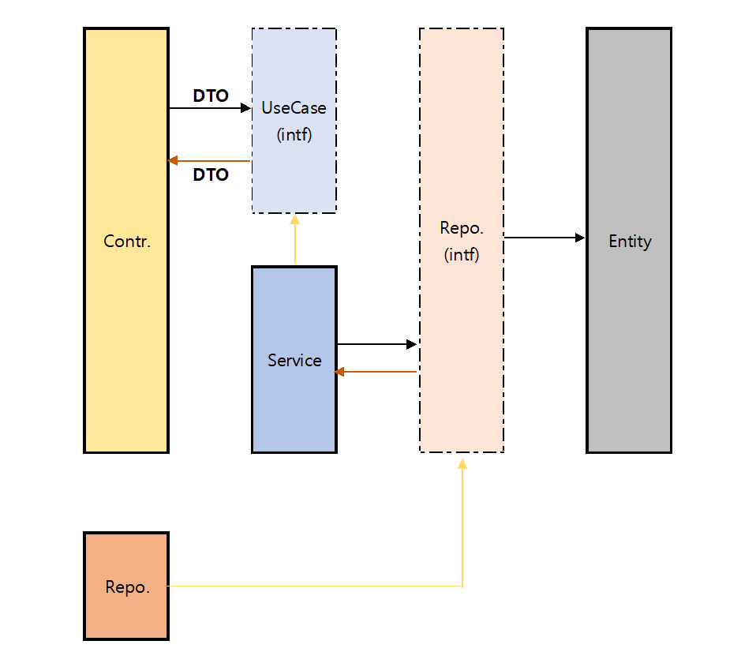

# 클린 아키텍처

클린 아키텍처를 공부한 이후 이번에 기회가 되어 구현을 해봤다.

많이 부족하지만 다음번에 참고하기 위해 글로 기록하려고 한다.

---

[프로젝트 정보]

**API 구현** 

**`Clean Architecture`**

Private Repository (비공개 프로젝트)

[개발환경]

- IntelliJ IDEA Community Edition 2021.3.1
- OpenJDK 17.0.1
- SpringBoot 2.4.1
- Gradle 7.2
- Swagger 2.9.2
- Git 2.30.0

[폴더구조]

`main`
java.com.ssg.be
----adapter.controller : 외부와 application 연결
----application : entity의 비즈니스 로직
--------dto : I/O에 사용되는 객체
--------repository : (interface) application에서 사용하는 Respostory
--------service : 비즈니스 로직 구현체
--------usecase : (interface) adapter에서 바라보는 비즈니스 로직
----entity : 핵심 객체 (entityA, entityB)
----config : configuration 정보

`test`
java.com.ssg.be.adapter.controller
---entityAController.java : entityA 정보 API 테스트
---entityBController.java : entityB 정보 API 테스트

[도식화]

