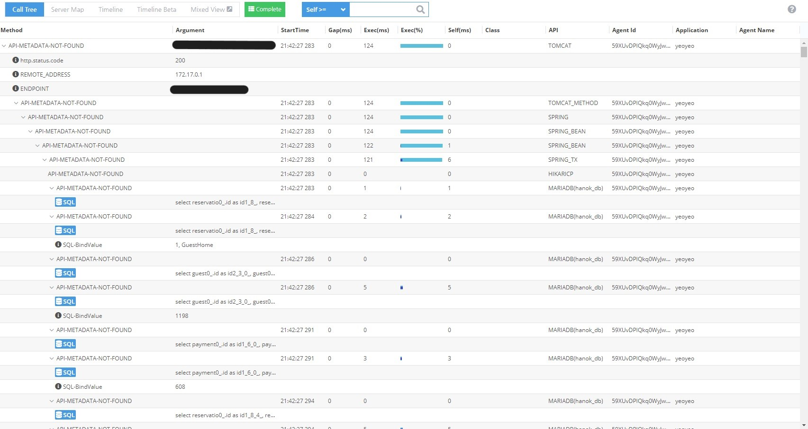
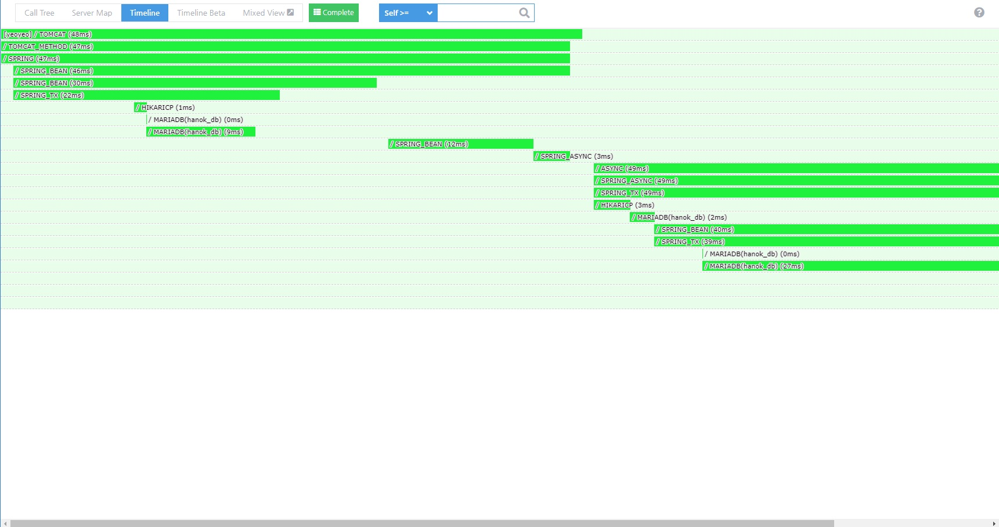
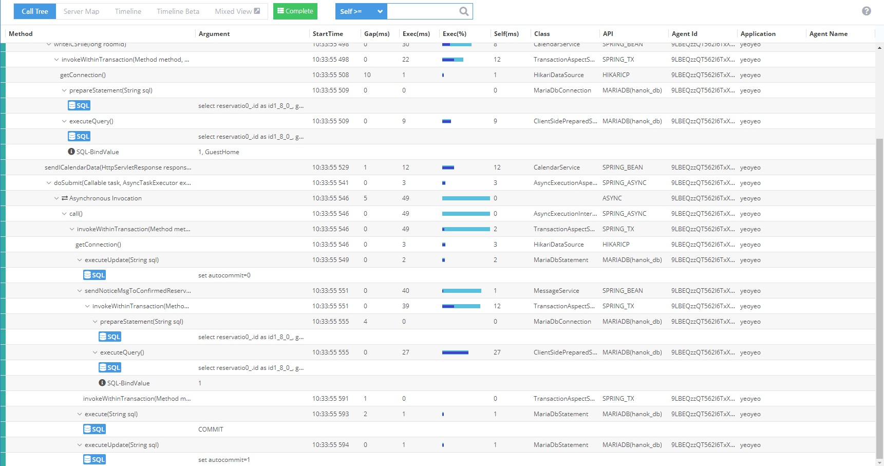

# N+1 문제 해결 - Entity Graph

## 발견

Pinpoint를 통해 모니터링을 하다가 문제점을 발견했다.

요청 하나에 200개에 가까운 쿼리가 보내지는 것이었다.

아래는 해당 요청에 대해 실행한 작업 과정인데,

오른쪽 스크롤을 보면 알 수 있겠지만 말도 안되게 많은 쿼리가 보내진다.

쿼리를 읽어보니 N+1 쿼리가 보내지고 있었다. (Reservation을 읽고, Guest와 Room을 따로 읽고 Payment도 그 뒤에 다시 따로 읽는다)

## 해결

N+1을 해결하기 위한 여러 방법이 있다.

Fetch Join이나 Entity Graph를 사용하거나, Batch Size를 설정해서 해결할 수도 있다.

- Fetch Join의 경우 Inner Join을 통해 조회 / Pagination 사용이 어려움, 대량의 데이터를 한 번에 가져와 메모리를 많이 사용, 1:N 조회 시 카테시안 곱
- Entity Graph의 경우 Outer Join을 통해 조회 / Pagination 사용이 어려움, 대량의 데이터를 한 번에 가져와 메모리를 많이 사용, 1:N 조회 시 카테시안 곱
- Batch Size의 경우 설정한 양만큼 한번에 조회 / 설정 값에 따라 성능이 크게 달라지므로, 적절한 Batch Size를 찾는 것이 중요

나의 경우 데이터양이 그렇게 많지 않아 한 번에 조회해도 괜찮으며 Reservation은 하나의 Guest와 Room, Payment를 가지므로 카테시안 문제도 없다. 또 위의 쿼리는 동기화를 위해 전체 데이터를 조회해야 하므로 Pagination의 문제도 없다.

그리고 Payment의 경우 없는 경우도 있기 때문에 Outer Join을 하는 Entity Graph를 사용했다.

## 결과

전반적으로 작업 효율이 많이 올라갔다.

시간도 많이 줄었으며

Timeline에선 스크롤이 없어졌고ㅎㅎ

Call을 보면 스크롤이 굉장히 많이 줄었음을 알 수 있다.

부가적으로 작업하면서 API-METADATA-NOTFOUND 문제도 해결했다.